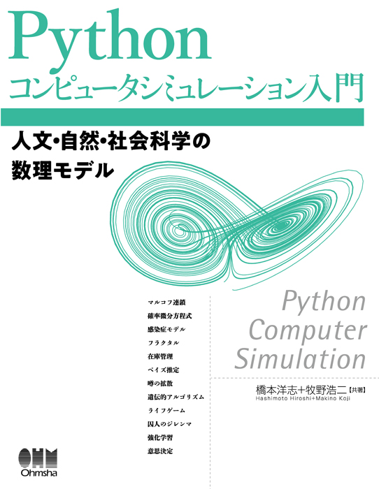

# Pythonコンピュータシミュレーション入門
# Python Computer Simulation

---

# 第1章 はじめに
# **Chapter 1 Introduction**

## 1.1 モデルとシミュレーション
## **1.1 Models and Simulation**

---

### モデルとは / **What is a Model**

- **モデル** (model) とは，対象とする物体や現象に対して，取り上げたい問題をよく表せるような本質的なものだけを抜き出して，何らかの形で表現したもの．
    - モデルの分け方は様々．ここでは，物理モデル (physical model) と論理モデル (logical model) に分けている．
    - [link]
- A **model** is a simplified or abstract representation of real-world systems or phenomena.

---

### シミュレーションとは / **What is Simulation**

- **シミュレーション**とは，モデルを用いてシステムの挙動を再現・予測する手法．
    - 疑似体験，予測，推定

- **Simulation** is a method of replicating or predicting the behavior of a system using a model.
    - simulation, forecast, estimate

---

### モデルの性質とシステム / **Properties of Models and Systems**

- 動的モデル (dynamical model)
    - 性質1: 入力を与えると出力が生じる．入力を止めてもしばらく出力が続く．
    - 性質2: 現在の出力は現在より過去の入力の影響により生じているもので，将来の入力の影響は受けていない．（因果性）

- 過渡状態（transient state）と定常状態（steady state）

- 決定論的モデル（deterministic model）と非決定論的モデル（non-deterministic model）
    - 確率モデル (stochastic model): 出力が確率過程（stochastic process）

- **システム (system)**

---

## 1.2 Python、Anaconda、パッケージ / **1.2 Python, Anaconda, and Packages**

- **Python**は汎用的な高水準プログラミング言語です。
- **Anaconda**はデータサイエンス向けのPythonディストリビューション（配布物，パッケージのセット）．
    - パッケージ管理と仮想環境の構築が容易．
- 関数，モジュール，パッケージ，ライブラリ

- **Python** is a versatile, high-level programming language.
- **Anaconda** is a Python distribution tailored for data science.
    - Simplifies package management and virtual environment setup.
- Functionm module, package, library

---

**Pythonライブラリの例 / Examples of Python Libraries**

| ライブラリ名 | 説明 / Description |
|:------------:|:-------------------|
| NumPy        | 科学計算ライブラリ．高速な配列操作が可能 / Scientific computing library with fast array operations. |
| SciPy        | 数値計算や統計解析のためのライブラリ / Library for numerical computation and statistical analysis. |
| Matplotlib   | グラフ描画ライブラリ / Library for data visualization and graph plotting. |
| Seaborn      | グラフ描画ライブラリ / Library for data visualization and statistical graphics. |
| Pandas       | データ解析ライブラリ．データフレームでの操作 / Data analysis library with DataFrame operations. |
| Scikit-learn | 機械学習ライブラリ / Machine learning library for model building and data classification. |
| TensorFlow   | ディープラーニング用ライブラリ / Deep learning library for neural network construction and training. |
| Keras        | TensorFlow上で動作する高レベルAPI / High-level API running on TensorFlow for easy neural network definition. |
| Flask        | 軽量なWebフレームワーク / Lightweight web framework for building web applications. |
| Django       | フルスタックのWebフレームワーク / Full-stack web framework for large-scale web application development. |
| BeautifulSoup| HTMLやXMLの解析ライブラリ / Library for parsing HTML and XML for web scraping. |
| SymPy        | 数式処理ライブラリ / Symbolic mathematics library for algebraic computations. |
| statsmodels  | 統計モデリングのためのライブラリ / Library for statistical modeling and testing. |
| Axelrod      | 囚人のジレンマ戦略シミュレーション / Simulation of Prisoner's Dilemma strategies. |
| Cartopy      | 地理空間データの可視化ライブラリ / Library for geospatial data visualization and mapping. |
| DEAP         | 遺伝的アルゴリズムのためのライブラリ / Library for genetic algorithms and evolutionary computation. |
| MeCab        | 形態素解析ライブラリ / Japanese morphological analysis library. |
| NetworkX     | グラフ理論のためのライブラリ / Library for the creation and analysis of graphs and networks. |
| PuLP         | 線形計画問題を解くためのライブラリ / Library for solving linear programming problems. |
| PyAudio      | 音声処理ライブラリ / Library for audio processing and playback. |
| PyMC3        | ベイズ統計モデリングのためのライブラリ / Library for Bayesian statistical modeling and probabilistic programming. |
| SimPy        | 離散事象シミュレーションライブラリ / Discrete-event simulation library. |
| VPython      | 3Dシミュレーションと可視化ライブラリ / Library for 3D simulation and visualization. |

---

## 1.3 開発環境 / **1.3 Development Environment**

- **統合開発環境**(**IDE**)としてJupyter NotebookやVisual Studio Code(VSCode)を使用．
    - コードの編集，実行，デバッグが容易
- クラウドコンピューティング (Google Colaboratory)

- Use **Integrated Development Environments (IDE)** like Jupyter Notebook or Visual Studio Code.
    - Facilitate easy code editing, execution, and debugging.
- Cloud Computing (Google Colaboratory)

---

## 1.4 ちょっとした流儀 / **1.4 Some Conventions**

- matplotlib
    - `IN_Matplotlib.ipynb`
- .ipynbと.py
    - `IN_TestScript.py`
- 文字コード (character code) とマジックコマンド (magic commands)

---

# 第2章 数値計算と数学の基礎
# **Chapter 2 Basics of Numerical Computation and Mathematics**

## 2.1 数学記号の用い方
## **2.1 Usage of Mathematical Symbols**

---

- ベクトル(vector)，行列(matrix)，ノルム（norm）
- $L^p$ノルム
    - $L^2$ノルム：ユークリッドノルム

$$
\sqrt[p]{|x_1|^p+|x_2|^p+\dots+|x_n|^p}
$$

---

## 2.2 有限桁のために生じる数値誤差 / **2.2 Numerical Errors Due to Finite Digits**

### 0.1変換誤差とIEEE754規格 / **0.1 Conversion Error and IEEE754 Standard**

- 0.1は二進数で正確に表現できない．
- 0.1 cannot be represented exactly in binary.

- **IEEE754**規格は浮動小数点数の表現方法を定めている．
- The **IEEE754** standard defines how floating-point numbers are represented.

### 機械イプシロン / **Machine Epsilon**

- **機械イプシロン**: 1よりも大きい最小の数と1との差（コンピュータが区別できる最小の差分）．数値計算の精度限界．
    - `==`や`!=`の判断には留意．
- **Machine epsilon** is the smallest difference distinguishable by the computer. Indicates the precision limit of numerical computations.

---

### 丸め、情報落ち、桁落ち / **Rounding, Cancellation Error, Loss of Significance**

- **丸め**は計算結果を有限桁に収めるための処理．
- **Rounding** adjusts calculation results to fit finite digits.
- **情報落ち**は大きな数値から小さな数値を足し引きする際に発生．
- **Cancellation error** occurs when adding/subtracting a small number from a large one.
- **桁落ち**は有効数字が減少する現象．
- **Loss of significance** is the reduction of significant digits.

---

## 2.3 いくつかの数値計算 / **2.3 Some Numerical Calculations**

-　数値解（numerical solution）と解析解（analytic solution）

### 連立一次方程式 / **Systems of Linear Equations**

### 方程式 / **Equations**

- 二次方程式の解の比較と非線形方程式の解法（ニュートン–ラフソン法）
- Solve nonlinear equations using numerical methods.  (Example: Newton-Raphson method)

`NC_Equation.ipynb`

---

#### ニュートン法のイメージ

By Ralf Pfeifer - de:Image:NewtonIteration Ani.gif, CC BY-SA 3.0, https://commons.wikimedia.org/w/index.php?curid=2268473

---

### 補間 / **Interpolation**

- 既知のデータ点から未知の値を推定する．
- Estimate unknown values from known data points.

- カーブフィッティング (curve fitting)
- ある距離で測った誤差のノルムを最小化する方法の利用が一般的．
- オーバーフィッティング (overfitting)，ルンゲの現象（Runge's Phenomenon）
    - 字数が大きい場合

`NC_Interpolation.ipynb`

---

### 常微分方程式 / **Ordinary Differential Equations (ODE)**

- 独立変数（ここでは$t$）と関数$f(t,x)$，及びその導関数を含む方程式．システムの連続的な変化をモデル化する．
    - 独立変数: 時間や位置など．
- Model continuous changes in a system.

$$
\frac{d^n}{dt^n}x(t)= f\left(t, x(t), \frac{d}{dt}x(t), \frac{d^2}{dt^2}x(t), \dots, \frac{d^{n-1}}{dt^{n-1}}x(t)\right)
$$

- 初期値問題（initial value problem）
    - 

- **SciPy**のODEソルバーを活用する．
- Utilize ODE solvers in **SciPy**.

`NC_ODE.ipynb`

---

## 2.4 確率の基礎 / **2.4 Basics of Probability**

---

### 確率とは / **What is Probability**

- **確率**はある事象が起こる可能性の度合いです。
- **Probability** is the measure of the likelihood that an event will occur.
- 0から1の範囲の値を取ります。
- Takes values between 0 and 1.

---

### 離散確率と連続確率 / **Discrete and Continuous Probability**

- **離散確率**は有限または可算無限の事象に適用。
- **Discrete probability** applies to finite or countably infinite events.
- **連続確率**は連続的な事象に適用。
- **Continuous probability** applies to continuous events.

---

### 母集団、パラメータ、期待値、分散、平均 / **Population, Parameter, Expectation, Variance, Mean**

- **母集団**は全体の集合。
- **Population** is the entire set.
- **パラメータ**は母集団の特性値。
- **Parameter** is a characteristic value of the population.
- **期待値**は平均的な結果。
- **Expectation** is the average outcome.
- **分散**はデータのばらつき。
- **Variance** measures data dispersion.

---

### 確率分布 / **Probability Distributions**

- データや事象の発生パターンを記述します。
- Describe the patterns of data or event occurrences.
- 例：正規分布、二項分布。
- Examples: Normal distribution, Binomial distribution.

---

## 2.5 疑似乱数とSciPyを用いた確率の計算 / **2.5 Pseudo-Random Numbers and Probability Calculations Using SciPy**

---

### 一様乱数の生成 / **Generation of Uniform Random Numbers**

- **NumPy**で一様分布の乱数を生成します。
- Generate uniformly distributed random numbers with **NumPy**.
- `numpy.random.uniform()`関数を使用。
- Use the `numpy.random.uniform()` function.

---

### 正規乱数の生成 / **Generation of Normal Random Numbers**

- 正規分布に従う乱数を生成。
- Generate random numbers following a normal distribution.
- `numpy.random.normal()`関数を使用。
- Use the `numpy.random.normal()` function.

---

### scipy.statsの使い方 / **How to Use scipy.stats**

- **scipy.stats**は統計的な関数を提供します。
- **scipy.stats** offers statistical functions.
- 確率分布の定義や統計量の計算が可能。
- Allows definition of probability distributions and calculation of statistics.

---

### パーセント点と確率の各種計算例 / **Examples of Various Calculations of Percentiles and Probabilities**

- **パーセント点**を計算して閾値を求めます。
- Calculate **percentiles** to find thresholds.
- 累積分布関数を用いて確率を計算。
- Use cumulative distribution functions to compute probabilities.

