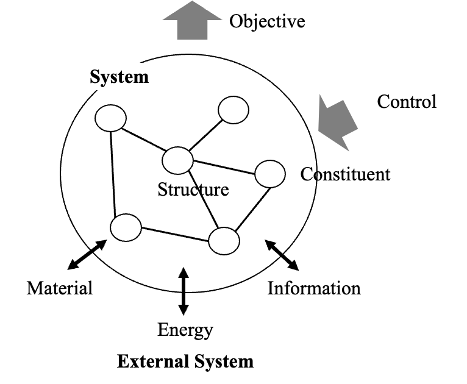
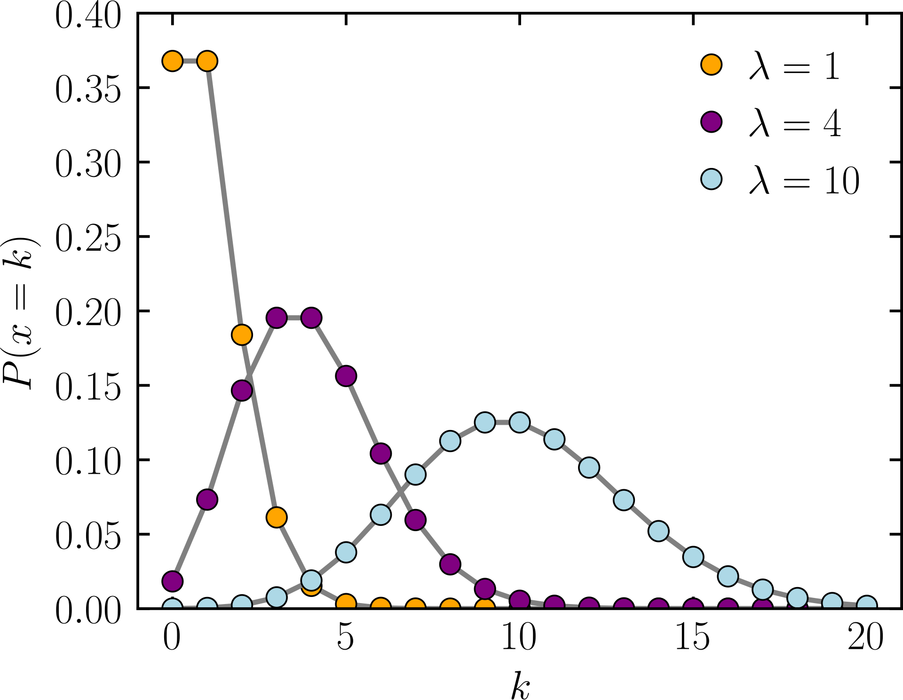
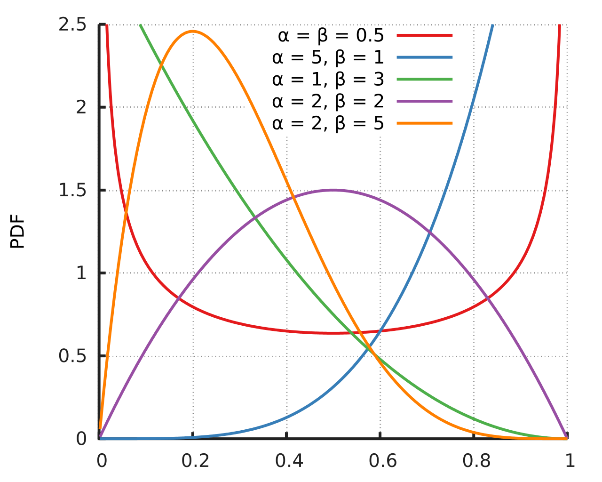

# Pythonコンピュータシミュレーション入門
# Python Computer Simulation


---

# 第1章 はじめに
# **Chapter 1 Introduction**

--

## 1.1 モデルとシミュレーション
## **1.1 Models and Simulation**

---

### モデルとは / **What is a Model**

- **モデル** (model) とは，対象とする物体や現象に対して，取り上げたい問題をよく表せるような本質的なものだけを抜き出して，何らかの形で表現したもの．
  - ref. “All Models are wrong, but some are useful.” (Box, 1976)
- モデルの分け方は様々: 物理モデル (physical model) / 論理モデル (logical model)
  - 概念モデル (conceptual model) と数値計算モデル (computational model)
  - ref. https://sebokwiki.org/wiki/Types_of_Models

--
- A **model** is a simplified version of something - a graphical, mathematical, or physical representation that abstracts reality to eliminate some complexity. (INCOSE)
- Model categorization: physical model, logical model
  - Conceptual model and computational model
 
---

#### Conceptual Model and Computerized Model 
- Sargent (1998)


---

### シミュレーションとは / **What is Simulation**

- **シミュレーション**とは，モデルを用いてシステムの挙動を再現・予測する手法．
    - 目的：疑似体験，予測，推定

--

- **Simulation** is a method of replicating or predicting the behavior of a system using a model.
    - Objective: simulated experience, forecast, estimate

---

### モデルの性質とシステム / **Properties of Models and Systems**

- 動的モデル (dynamical model)
  - 性質1: 入力を与えると出力が生じる．入力を止めてもしばらく出力が続く．
  - 性質2: 現在の出力は現在より過去の入力の影響により生じているもので，将来の入力の影響は受けていない．（因果性）
- 過渡状態と定常状態
- 決定論的モデルと非決定論的モデル（確率モデル: 出力が確率過程）

--
- Dynamical model
  - Property 1: When an input is given, an output is produced. Even if the input is stopped, the output continues for a while.
  - Property 2: The current output is produced by the influence of the past input, and is not influenced by the future input. (causality)
- Transient state and steady state
- Deterministic and non-deterministic model (Stochastic model and stochastic process)

---

### システム / **System**
- A system is a construct or collection of different elements that together produce results not obtainable by the elements alone (INCOSE)
- System has Objective, Multiple elements, Structure (network), and Controllability (Fujita, 2023)


---

## 1.2 Python, Anaconda, パッケージ / **1.2 Python, Anaconda and Packages**

- [**Python**](https://www.python.org/)：汎用的な高水準プログラミング言語．
- [**Anaconda**](https://www.anaconda.com/)：データサイエンス向けのPythonディストリビューション（配布物，パッケージのセット）．パッケージ管理と仮想環境の構築が容易．
- 関数，モジュール，パッケージ，ライブラリ
  - [Python標準ライブラリ](https://docs.python.org/ja/3/library/)

--

- **Python** is a versatile, high-level programming language.
- **Anaconda** is a Python distribution tailored for data science.
    - Simplifies package management and virtual environment setup.
- Function, module, package, library
  - [The Python Standard Library](https://docs.python.org/3/library/)

---

**Pythonライブラリの例 / Examples of Python Libraries**

| ライブラリ名 | 説明 / Description |
|:------------:|:-------------------|
| NumPy        | 科学計算ライブラリ．高速な配列操作が可能 / Scientific computing library with fast array operations. |
| SciPy        | 数値計算や統計解析のためのライブラリ / Library for numerical computation and statistical analysis. |
| Matplotlib   | グラフ描画ライブラリ / Library for data visualization and graph plotting. |
| Seaborn      | グラフ描画ライブラリ / Library for data visualization and statistical graphics. |
| Pandas       | データ解析ライブラリ．データフレームでの操作 / Data analysis library with DataFrame operations. |
| Scikit-learn | 機械学習ライブラリ / Machine learning library for model building and data classification. |
| TensorFlow   | ディープラーニング用ライブラリ / Deep learning library for neural network construction and training. |
| Keras        | TensorFlow上で動作する高レベルAPI / High-level API running on TensorFlow for easy neural network definition. |
| Flask        | 軽量なWebフレームワーク / Lightweight web framework for building web applications. |
| Django       | フルスタックのWebフレームワーク / Full-stack web framework for large-scale web application development. |
| BeautifulSoup| HTMLやXMLの解析ライブラリ / Library for parsing HTML and XML for web scraping. |
| SymPy        | 数式処理ライブラリ / Symbolic mathematics library for algebraic computations. |
| statsmodels  | 統計モデリングのためのライブラリ / Library for statistical modeling and testing. |
| Axelrod      | 囚人のジレンマ戦略シミュレーション / Simulation of Prisoner's Dilemma strategies. |
| Cartopy      | 地理空間データの可視化ライブラリ / Library for geospatial data visualization and mapping. |
| DEAP         | 遺伝的アルゴリズムのためのライブラリ / Library for genetic algorithms and evolutionary computation. |
| MeCab        | 形態素解析ライブラリ / Japanese morphological analysis library. |
| NetworkX     | グラフ理論のためのライブラリ / Library for the creation and analysis of graphs and networks. |
| PuLP         | 線形計画問題を解くためのライブラリ / Library for solving linear programming problems. |
| PyAudio      | 音声処理ライブラリ / Library for audio processing and playback. |
| PyMC3        | ベイズ統計モデリングのためのライブラリ / Library for Bayesian statistical modeling and probabilistic programming. |
| SimPy        | 離散事象シミュレーションライブラリ / Discrete-event simulation library. |
| VPython      | 3Dシミュレーションと可視化ライブラリ / Library for 3D simulation and visualization. |

---

## 1.3 開発環境 / **1.3 Development Environment**

- **統合開発環境**(**IDE**)としてJupyter NotebookやVisual Studio Code(VSCode)を使用．
    - コードの編集，実行，デバッグが容易
- クラウドコンピューティング ([Google Colaboratory](https://colab.research.google.com/))

--

- Use **Integrated Development Environments (IDE)** like Jupyter Notebook or Visual Studio Code.
    - Facilitate easy code editing, execution, and debugging.
- Cloud Computing (Google Colaboratory)

---

## 1.4 ちょっとした流儀 / **1.4 Some Conventions**

- matplotlib
    - `code/Chap1/IN_Matplotlib.ipynb`
- .ipynb and .py
    - `code/Chap1/IN_TestScript.py`
- 文字コード (character code) とマジックコマンド (magic commands)

---

# 第2章 数値計算と数学の基礎
# **Chapter 2 Basics of Numerical Computation and Mathematics**

---

## 2.1 数学記号の用い方
## **2.1 Usage of Mathematical Symbols**

- ベクトル(vector)，行列(matrix)
- ノルム（norm）
  - 平面あるいは空間における幾何学的ベクトルの "長さ" の概念の一般化であり、ベクトル空間に対して「距離」を与えるための数学の道具(wikipedia)
  - a function from a real or complex vector space to the non-negative real numbers that behaves in certain ways like the distance from the origin (wikipedia)
- $L^p$ノルム
  - $L^1$ノルム：マンハッタンノルム (Manhattan norm)
  - $L^2$ノルム：ユークリッドノルム (Euclid norm)

$$
\sqrt[p]{|x_1|^p+|x_2|^p+\dots+|x_n|^p}
$$

---

#### Ref. Lasso回帰とRidge回帰 / **Lasso Regression and Ridge Regression**
- **正則化**：自由度の数をうまく減らし，過学習を防ぐ．
**Regularization**: The number of degrees of freedom is reduced appropriately to prevent overfitting.

- **L1正則化（Lasso回帰）**: L1ノルム$\| \mathbf{w} \|_1$を用いた回帰分析．寄与が小さい重みをゼロにする．
**L1 regularization (Lasso regression)**: Regression analysis using the L1 norm $\| \mathbf{w} \|_1$. We set the weights with small contributions to zero.


$$
\min_{\mathbf{w}} \left( \sum_{i=1}^{n} (y_i - \mathbf{x}_i^T \mathbf{w})^2 + \lambda \| \mathbf{w} \|_1 \right) 
$$

- **L2正則化（Ridge回帰）**: L2ノルム$\| \mathbf{w} \|_2$を用いた回帰分析．寄与が小さい重みを抑える．
**L2 regularization (Ridge regression)**: Regression analysis using the L2 norm $\| \mathbf{w} \|_2$. It suppresses weights with small contributions.

$$
\min_{\mathbf{w}} \left( \sum_{i=1}^{n} (y_i - \mathbf{x}_i^T \mathbf{w})^2 + \lambda \| \mathbf{w} \|_2^2 \right)
$$

---

## 2.2 有限桁のために生じる数値誤差 / **2.2 Numerical Errors Due to Finite Digits**

### 0.1変換誤差とIEEE754規格 / **0.1 Conversion Error and IEEE754**

- 0.1は二進数で正確に表現できない．
- **IEEE754**規格は浮動小数点数の表現方法を定めている．
- **機械イプシロン**: 1よりも大きい最小の数と1との差（コンピュータが区別できる最小の差分）．数値計算の精度限界（`==`や`!=`の判断には留意）．

--

- 0.1 cannot be represented exactly in binary.
- The **IEEE754** standard defines how floating-point numbers are represented.
- **Machine epsilon** is the smallest difference distinguishable by the computer. Indicates the precision limit of numerical computations.

---

### 丸め、情報落ち、桁落ち / **Rounding, Cancellation Error, Loss of Significance**

- **丸め**: 計算結果を有限桁に収めるための処理．
- **情報落ち**: 大きな数値から小さな数値を足し引きする際に発生．
- **桁落ち**: 有効数字が減少する現象．

--

- **Rounding** adjusts calculation results to fit finite digits.
- **Cancellation error** occurs when adding/subtracting a small number from a large one.
- **Loss of significance** is the reduction of significant digits.

---

## 2.3 いくつかの数値計算 / **2.3 Some Numerical Calculations**

- 数値解（numerical solution）と解析解（analytic solution）

### 連立一次方程式 / **Systems of Linear Equations**


### 方程式 / **Equations**

- 二次方程式の解の比較と非線形方程式の解法（ニュートン–ラフソン法）
Solve nonlinear equations using numerical methods.  (Example: Newton-Raphson method)

`NC_Equation.ipynb`

---

#### ニュートン法のイメージ / **Image of Newton-Raphson method**

By Ralf Pfeifer - de:Image:NewtonIteration Ani.gif, CC BY-SA 3.0, https://commons.wikimedia.org/w/index.php?curid=2268473

---

### 補間 / **Interpolation**

- 既知のデータ点から未知の値を推定する．
- カーブフィッティング (curve fitting)
  - ある距離で測った誤差のノルムを最小化する方法の利用が一般的．
- オーバーフィッティング (overfitting)，ルンゲの現象（Runge's Phenomenon）

--

- Estimating unknown values from known data points.
- Curve fitting
  - minimizing the norm of the error measured at a certain distance
- Overfitting, Runge's Phenomenon
`NC_Interpolation.ipynb`

---

### 常微分方程式 / **Ordinary Differential Equations (ODE)**

- 独立変数（ここでは$t$）と関数$f(t,x)$，及びその導関数を含む方程式．システムの連続的な変化をモデル化する．（独立変数: 時間や位置など）

$$
\frac{d^n}{dt^n}x(t)= f\left(t, x(t), \frac{d}{dt}x(t), \frac{d^2}{dt^2}x(t), \dots, \frac{d^{n-1}}{dt^{n-1}}x(t)\right)
$$

- 連続系を離散系で表現: 離散時刻を$t_k(k=0,1,\dots,N-1)$，$t_{k+1}=t_k+\Delta t(k+1)$と表現
  - $\Delta t(k+1)$は一定または可変

--
- An equation that includes an independent variable (here, $t$), a function $f(t,x)$, and its derivative. It models the continuous change of a system. 
(Independent variable: time, position, etc.)
- Continuous systems are expressed as discrete systems: Discrete time is expressed as $t_k(k=0,1,\dots,N-1)$ and $t_{k+1}=t_k+\Delta t(k+1)$
  - $\Delta t(k+1)$ is either constant or variable


---

### 初期値問題 / **initial value problem**

**P1** 初期値をどう定めるか
**P2** p(ステップ分の過去の確定した値)をどこまで用いるか
**P3** 刻み幅$\Delta t(k+1)$をどう定めるか
**P4** テイラー展開を何次まで実施すべきか
**P5** 微分の近似がしにくい微分方程式をどうすべきか（stiffness）

--

**P1** How to determine the initial value
**P2** How far back to use p(the previously determined value for the number of steps)
**P3** How to determine the increment width $\Delta t(k+1)$
**P4** How many terms of the Taylor expansion should be carried out
**P5** What to do with differential equations that are difficult to approximate (stiffness)

<!-- - オイラー法，ルンゲクッタ法：自己出発型のためP1, P2は不問．
- 次数や刻み幅$\Delta t(k+1)$を適用的に変化させることが考えられている．
- **SciPy**のODEソルバーを活用する．
- Utilize ODE solvers in **SciPy**. -->

---

### 質量・ダンパ・ばねシステム / **Mass-Spring-Damper System**

質量 ( mass: m )、ダンパ (damper, 減衰係数: c)、ばね (spring, 剛性係数: k) の運動方程式 (equation of motion):

$$
m \frac{d^2 x(t)}{dt^2} + c \frac{dx(t)}{dt} + k x(t) = F(t)
$$

- $m$ : 質量 / mass
- $c$ : 減衰係数 / damper coefficient
- $k$ : ばねの剛性係数 / spring coefficient
- $x(t)$ : 変位（時間 $t$ に依存） / position
- $F(t)$ : 外力（時間 $t$ に依存） / external force

`NC_ODE.ipynb`

---

## 2.4 確率の基礎 / **2.4 Basics of Probability**
<!-- ### 確率とは / **What is Probability** -->
- **Probability** is the measure of the likelihood that an event will occur.
  <!-- - 標本空間 / Sample space
  - 確率分布 / Probability distribution -->

<!-- $$
\frac{期待する事象の起こる場合の数}{起こりうるすべての事象の場合の数}
$$

$$
\frac{\textrm{number of cases where the expected events occur}}{\textrm{number of cases where all possible events occur}}
$$ -->

#### 離散確率と連続確率 / **Discrete and Continuous Probability**

- **離散確率変数** / **Discrete probability**

$$
X=\{x_1,x_2,\dots,x_n\} := \{x_i\}
$$
$$
P(X=x_i)=p_i
$$

- **連続確率変数** / **Continuous probability**

$$
P(a\le X\le b)=\int_a^b{f(x)dx}
$$

- 連続確率変数で表現される時，"ATM利用時間が30秒である確率"は？
When expressed as a continuous probability, what is the probability of “using time of ATM = 30 seconds”?

---

### 母集団、パラメータ、期待値、分散、平均 / **Population, Parameter, Expectation, Variance, Mean**

- **母集団**は調査対象となる集団全体．
- **パラメータ**は母集団の特性値．母数ともいう．
- **期待値**は平均的な結果．
- **分散**はデータのばらつき．

--
- **Population** is the entire set.
- **Parameter** is a characteristic value of the population.
- **Expectation** is the average outcome.
- **Variance** measures data dispersion.

---

### 確率変数の平均と分散 / **Mean and Variance**

#### Discrete probability

$$
E(X) := \mu = \sum_{i} x_i P(X = x_i)
$$

$$
V(X) := \sigma^2 = \sum_{i} (x_i - \mu)^2 P(X = x_i)
$$

#### Continuous probability

$$
E(X) := \mu = \int_{-\infty}^{\infty} x f_X(x) \, dx
$$


$$
V(X) := \mu = E[(X - E[X])^2] =\int_{-\infty}^{\infty} (x - E(X))^2 f_X(x) \, dx
$$

---

### 離散確率分布 / Discrete Probability Distributions

#### ベルヌーイ分布 / **Bernoulli Distribution**

- 成功（1）または失敗（0）しかない試行の分布（$p$: 成功確率）
The Bernoulli distribution models binary outcomes, such as success/failure or true/false, with probability $p$ for success.
  $$
  f(k;p) = p^k (1 - p)^{1 - k}, \quad k \in [0, 1]
  $$
  $$
  E[X] = p, \quad V[X] = p(1 - p)
  $$

#### 二項分布 / **Binomial Distribution**

- $n$回のベルヌーイ試行における成功の数の分布（$n$: 試行回数, $p$: 成功確率）
The Binomial distribution models the number of successes in $n$ independent trials, each with success probability $p$.
  $$
  f(k; p) = \binom{n}{k} p^x (1 - p)^{n - k}, \quad k = 0, 1, 2, \dots, n
  $$
  $$
  E[X] = n p, \quad V[X] = n p (1 - p)
  $$

---

#### ポアソン分布 / **Poisson Distribution**

- 一定の時間または空間内におけるランダムなイベントの発生回数の分布 ($\lambda$: 平均発生率)
（例：病院への救急患者の到着数, ウェブサイトへのアクセス数）
The Poisson distribution models the number of rare events occurring in a fixed interval of time or space, with average rate $\lambda$. 
(e.g., the number of emergency patients at a hospital, the number of visits to a website.)
  $$
  f(k;\lambda) = \frac{\lambda^k e^{-\lambda}}{k!}, \quad k = 0, 1, 2, \dots
  $$
  $$
  E[X] = \lambda, \quad V[X] = \lambda
  $$

<!--  -->

---

#### 一様分布 / **Discrete Uniform Distribution**

- ある実数区間[a,b]において，すべての値を同等に取る分布．
The Uniform distribution assigns equal probability to all outcomes within the interval [a, b].
  $$
  f(x) = 
    \begin{cases}
        \frac{1}{b-a} & (a \le x \le b)\\
        0 & (\text{otherwise})
    \end{cases}
  $$
  $$
  E[X] = \frac{1}{2}(a+b), \quad V[X] = \frac{1}{12}(b-a)^2
  $$

#### 正規分布 / **Normal Distribution**
- 自然界や社会現象における多くの連続データ（例：身長, 体重, 試験の得点）の分布をモデル化．最もよく使われる確率分布の一つ．
The Normal distribution, often referred to as the Gaussian distribution, is used to model continuous variables that cluster around a mean.
  $$
  f(x) = \frac{1}{\sqrt{2\pi \sigma^2}} \exp\left(-\frac{(x - \mu)^2}{2 \sigma^2}\right)
  $$
  $$
  E[X] = \mu, \quad  V[X] = \sigma^2
  $$

---

#### 指数分布 / **Exponential Distribution**

- ランダムなイベントの間隔をモデル化する分布（例：次の電話までの時間，電子部品の寿命）
The Exponential distribution is commonly used to model the time between events in a Poisson process.
  $$
  f(x) = \lambda e^{-\lambda x}, \quad x \geq 0
  $$
  $$
  E[X] = \frac{1}{\lambda}, \quad  V[X] = \frac{1}{\lambda^2}
  $$

###### ガンマ分布 / **Gamma Distribution**
- 待ち時間をモデル化するために使用される．指数分布の一般化された形．
The Gamma distribution is a generalization of the Exponential distribution, often used to model waiting times in a process.

###### ワイブル分布 / **Weibull Distribution**
- 製品やシステムの寿命，故障時間をモデル化するために広く使われる確率分布．
The Weibull distribution is widely used in reliability engineering and survival analysis to model the lifetime or failure time of products and systems.
---

#### ベータ分布 / **Beta Distribution**

- (0,1)の区間にある確率の分布．確率や割合（例：成功率，投票率，信頼度）のモデリングに使用．ベイズ統計でも利用．
The Beta distribution is used to model probabilities or proportions, commonly applied in Bayesian statistics.
    - $\alpha$, $\beta$: 形状パラメータ / Shape parameters
    - $B(\alpha, \beta)$: ベータ関数 / Beta function
  $$
  f(x) = \frac{x^{\alpha - 1}(1 - x)^{\beta - 1}}{B(\alpha, \beta)}, \quad 0 \leq x \leq 1
  $$
  $$
  E[X] = \frac{\alpha}{\alpha + \beta}, \quad
  V[X] = \frac{\alpha \beta}{(\alpha + \beta)^2 (\alpha + \beta + 1)}
  $$



---

## 2.5 疑似乱数とSciPyを用いた確率の計算 / **2.5 Pseudo-Random Numbers and Probability Calculations Using SciPy**

### 一様乱数の生成 / **Generation of Uniform Random Numbers**
- **線形合同法 / Linear Congruential Method**

$$
X_{n+1} = (a X_n + n) \, \text{mod} \, M
$$

- **メルセンヌ・ツイスタ / Mersenne Twister （MT19937）**
  - 疑似乱数生成アルゴリズムの一種．非常に長い周期と高い性能を持つ（$2^{19937} - 1$）．
  A type of pseudorandom number generation algorithm with an extremely long period and high performance($2^{19937}−1$). 
  - Pythonや多くのプログラミング言語でデフォルトの乱数生成アルゴリズムとして採用．
  Default random number generation algorithm in Python and many other programming languages.

---

### 正規乱数の生成 / **Generation of Normal Random Numbers**
- ボックス・ミュラー法 / Box-Muller Method
    - 互いに独立の一様乱数$U_1,U_2$を用いて，
    Using two independent uniform random numbers $U_1$ and $U_2$

$$
Z_0 = \sqrt{-2 \ln U_1} \cos(2 \pi U_2)
$$

$$
Z_1 = \sqrt{-2 \ln U_1} \sin(2 \pi U_2)
$$


- 他に，逆関数法，棄却法 など
Other methods: Inverse Transform Sampling, Rejection Sampling etc.
---

### scipy.statsの使い方 / **How to Use scipy.stats**

| メソッド    | 説明 / Description                                                        | 用途 / Purpose                                             |
|:------------|:-------------------------------------------------------------------------|:----------------------------------------------------------|
| `rvs`       | ランダム変数を生成します / Generates random variables                     | 乱数の生成 / Generate random numbers                       |
| `pmf`       | 離散分布の確率質量関数 / Probability Mass Function (for discrete dist.)   | 離散的な値が取る確率を計算 / Compute probability of a discrete outcome |
| `pdf`       | 連続分布の確率密度関数 / Probability Density Function (for continuous dist.) | 連続的な値の確率密度を計算 / Compute the probability density of a continuous outcome |
| `cdf`       | 累積分布関数 / Cumulative Distribution Function                          | 値がある閾値以下になる確率を計算 / Compute the probability that a random variable is less than or equal to a certain value |
| `ppf`       | 分位点関数 / Percent Point Function (Inverse of CDF)                     | 累積確率に対応する値を返す / Returns the value corresponding to a given cumulative probability |
| `isf`       | サバイバル分位点関数 / Inverse Survival Function (1 - CDF)               | 1 - CDF の逆関数で、累積確率の逆を返す / Returns the value corresponding to a given upper cumulative probability (1 - CDF) |
| `interval`  | 信頼区間を計算 / Confidence Interval Calculation                         | 指定した信頼度に基づいて分布の区間を計算 / Compute the confidence interval for the given distribution |


- パーセント点と確率の各種計算例 / **Examples of Various Calculations of Percentiles and Probabilities**
    - `NC_ProbabilityCalc.ipynb`

---

### 演習問題 / **Exercise**

次の非線形常微分方程式をPythonを用いて解いてください．
Solve the following nonlinear ordinary differential equation (ODE) using Python.

$$
\frac{dy}{dx} = y^2 - x
$$

- 初期条件 (initial condition): $y(0) = 1$
- 範囲 (range): $x \in [0, 2]$

**ヒント**: `scipy.integrate.solve_ivp` を使用して数値的に解くことができます。  
**Hint**: You can use `scipy.integrate.solve_ivp` to solve this numerically.

---

### 解答例 (Pythonコード) / **Example Solution (Python Code)**

```python
import numpy as np
from scipy.integrate import solve_ivp
import matplotlib.pyplot as plt

# 非線形常微分方程式 dy/dx = y^2 - x を定義
# Define the nonlinear ODE: dy/dx = y^2 - x
def dydx(x, y):
    return y**2 - x

# 初期条件 y(0) = 1
# Initial condition y(0) = 1
y0 = [1]

# x の範囲 [0, 2]
# Range of x: [0, 2]
x_range = (0, 2)

# 微分方程式を解く
# Solve the ODE
solution = solve_ivp(dydx, x_range, y0, t_eval=np.linspace(0, 2, 100))

# 結果をプロット
# Plot the result
plt.plot(solution.t, solution.y[0], label="y(x)")
plt.xlabel('x')
plt.ylabel('y')
plt.title(r'$\frac{dy}{dx} = y^2 - x$')
plt.legend()
plt.grid(True)
plt.show()
```

<style>
/* スライドの基本設定 */
section {
  font-size: 20pt;  /* 本文のフォントサイズ */
  color: #333333;   /* 本文の色 */
}

/* 見出しのカスタマイズ */
h1 {
  font-size: 32pt;  /* h1 見出しのフォントサイズ */
  color: #2E8B57;   /* h1 見出しの色 */
}

h2 {
  font-size: 28pt;  /* h2 見出しのフォントサイズ */
  color: #4682B4;   /* h2 見出しの色 */
}

/* スライドの背景色を変更したい場合 */
section {
  background-color: #f9f9f9;  /* 背景色 */
}

/* 箇条書きリストのカスタマイズ */
ul {
  font-size: 18pt;  /* 箇条書きのフォントサイズ */
}

table {
  font-size: 10pt; /* 文字サイズを12ptに設定 */
  margin: auto;
  text-align: left;
}

</style>