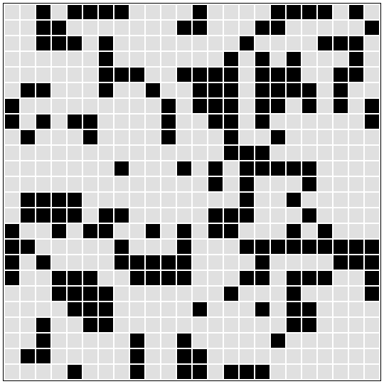
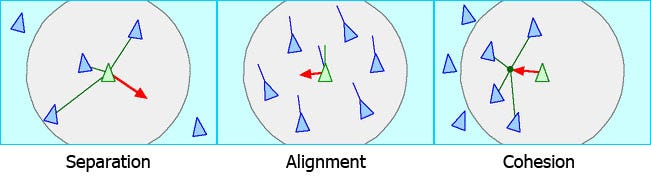
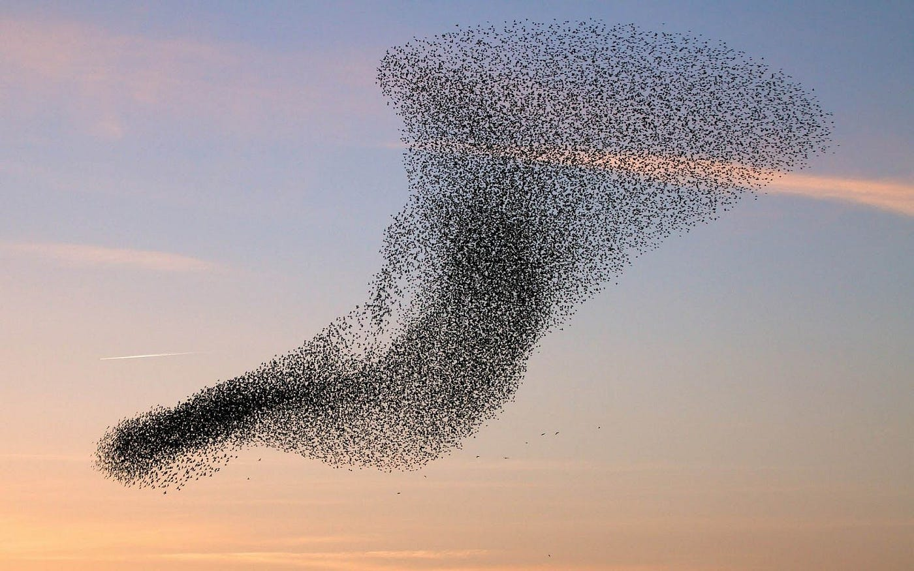
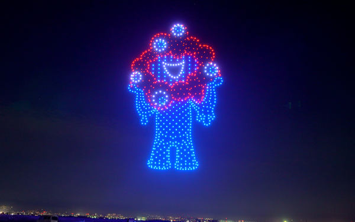
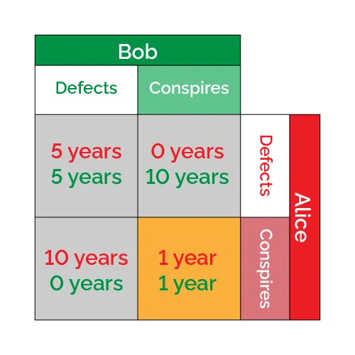
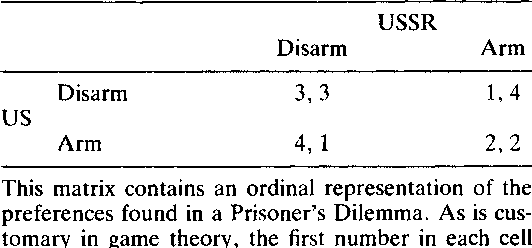
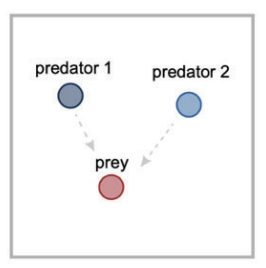

# Python Computer Simulation

---

# **Chapter 5 Agent-base model**

--

## **5.1 Overview of agent-based model**
## **5.2 Example #1: Game of Life**
## **5.3 Example #2: Boids**
## **5.4 Example #3: Prisoner's dilemma**
## **5.5 Multi-agent model and reinforcement learning**

---

### **5.1 Overview of agent-based model**

- What is an **agent (エージェント)** about?
  - An agent makes decisions or behaves following rules.
  - An agent affects other agents or environments.
- **Agent-based model**
  - An agent-based model simulates beased on behavior of agent(s)
  - An agent-based model enables you to analyze holistic (全体的な) behavior of society by simulating the behavior, movement, action, and status of agents on computer.
  - Example: Traffic simulation, Evacuation (非難) simulation in an emergency, spread on socials (SNS), collective behavior of organisms, artificial lives.
- There are mainly two types of agent.
  1. Movable agents move in environment.
  2. Immovable agents just make decisions without moving.
- ***Detailed models for agents do NOT always generate holistic behavior of society well.***
- ***To build agent-based models, it is important how you abstract the abjects.***
 
---

### **5.2 Example #1: Game of Life**

- What is **Game of Life (ライフゲーム)** about?
  - Game of Life models birth and death of lives.
  - The black cells are alive, and the white ones are dead.
  - The agents appear to move from cell to cell.
  - You can check the regular creatures for Game of Life. -> https://conwaylife.com/wiki/
- Four basic rules for Game of Life
  1. Birth: A white cell turns black when it touches three black cells.
  2. Survival: A black cell stay black when it touches two or three black cells.
  3. Depopulation (過疎): A black cell turns white when it touches one or fewer black cell.
  4. Overpopulation: A black cell turns white when it touches four or more black cells.
- ***Game of Life is a fundamental model with agents moving in discrete environment.***

---

### **5.2 Example #1: Game of Life**

- Game of Life itself has few practical applications.
- However, the simple rules and initial conditions of Game of Life generate many vrieties of complex behavior, figures, and patterns.
- ***Game of Life provides a good example of modeling complex behavior with simple essential rules.***
- Rule 30 of Game of Life generates a chaotic pattern, which is similar to the pattern of cone snails (イモガイ).
- ***Game of Life also suggests that complex systems in nature may be generated by simple rules.***

---

### **5.3 Example #2: Boids**
- What is **Boids** about?
  - Boids model flocks (群れ) of birds with a few simple rules.
  - The agents move on a continous plane, not discrete.
- Three basic rules for Boids
  1. Separation: If any other agent in an area, an agent gets away from them.
  2. Alignment: If any other agent in an area, an agent moves in the same direction as them.
  3. Cohesion: If any other agent in an area, an agent gets close to their centroid (重心).
  - Note that each area for the separation, alignment, and cohesion are defined separately.
- ***Boids are a fundamental model with agents moving in continous environment.***

---

### **5.3 Example #2: Boids**
- Boids reproduce flocks of birds well with a few simple rules.
- Boids are applied to simulations and computer graphics (CG) for flocks of birds.
- ***Boids suggests that complex behavior of flocks, herds, and schools in nature are generated by simple rules.***
- Many additional rules have been proposed for extended Boids, with obstacles, distinations, and randomization.
- Boids are applied to simulations for flow of people, schools of fish, drone shows, autonomous cars, and even artworks.

---

### **5.4 Example #3: Prisoner's dilemma**
- What is **prisoner's dilemma (囚人のジレンマ)** about?
  - Prisoner's dilemma models two prisoners cooperating and betraying.
  - The agents just make decisions without moving.
  - The agents gain benefits depending on the combination of their desion-making.
- ***Prisoner's dilemma is a fundamental model with agents making decisions without moving.***

---

### **5.4 Example #3: Prisoner's dilemma**
- ***Prisoner's dilemma models well the mismatches between socially optimal strategy and individually optimal strategy.***
  - **Pareto efficiency (パレート最適)** is a situation where one or more agents need(s) to decrease the profits to increase the profits of other agent(s).
  - **Nash equilibrium (ナッシュ均衡)** is a situation where no agent could increase their profits by changing their own strategy.
- Prisoner's dilemma is applied to cooperative behaviors for animals and arms races (軍拡競争).
- You can check the regular strategies for iterated (繰り返し) prisoner's dilemma. -> https://plato.stanford.edu/entries/prisoner-dilemma/strategy-table.html

---

### **5.5 Multi-agent model and reinforcement learning**
- The decision-making rules in this lecture are very simple.
- ***You can build a model, with multiple agents making decision by reinforcement learning.***
- An exapmle of this combination is a hunting game.
  - Predators and a prey move on a closed plane.
  - The predetors need to hunt the prey together.
  - The prey runs away from the predetors.
  - The predetors learn strategies to hunt the prey by reinforcement learning, such as pincer movement (挟み撃ち) and ambushment (待ち伏せ).

