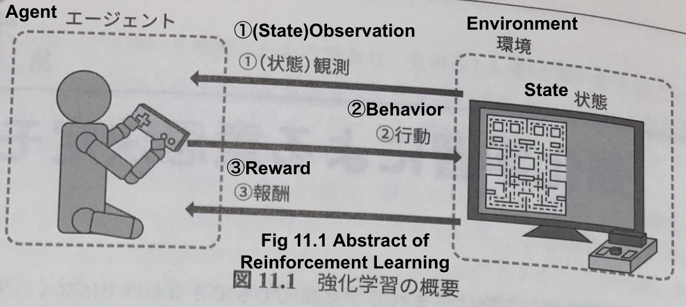
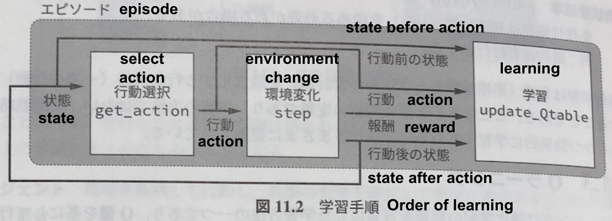
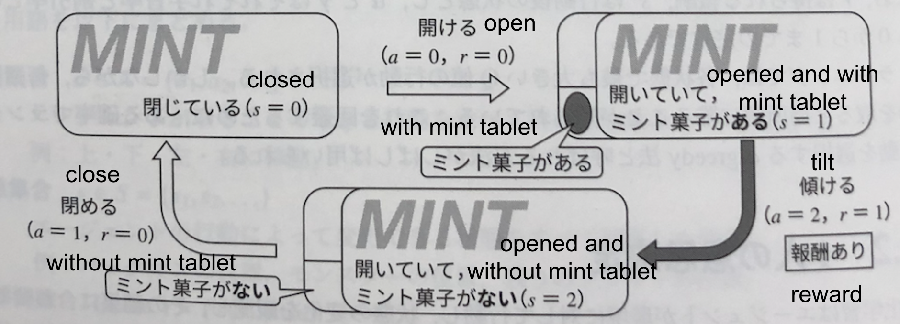
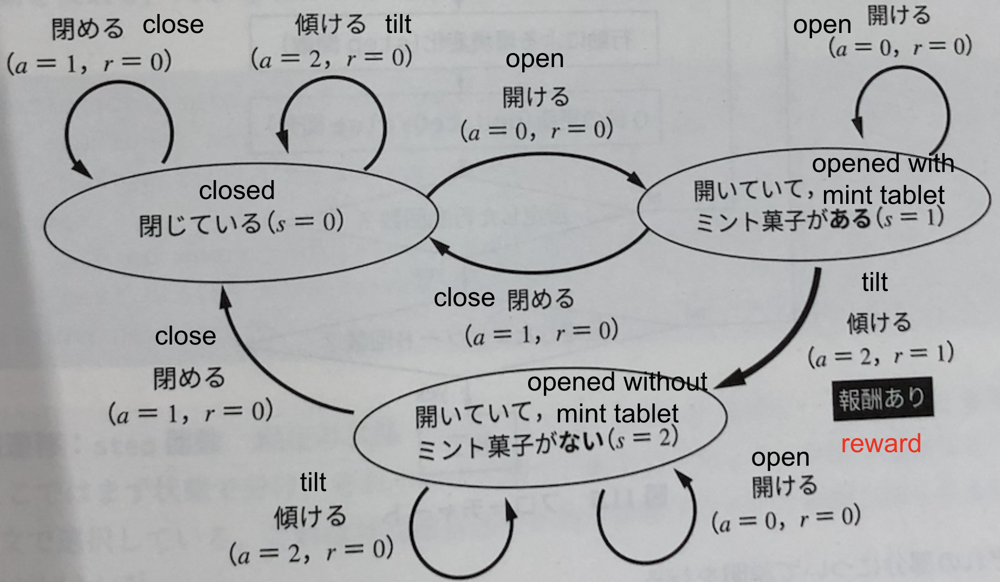
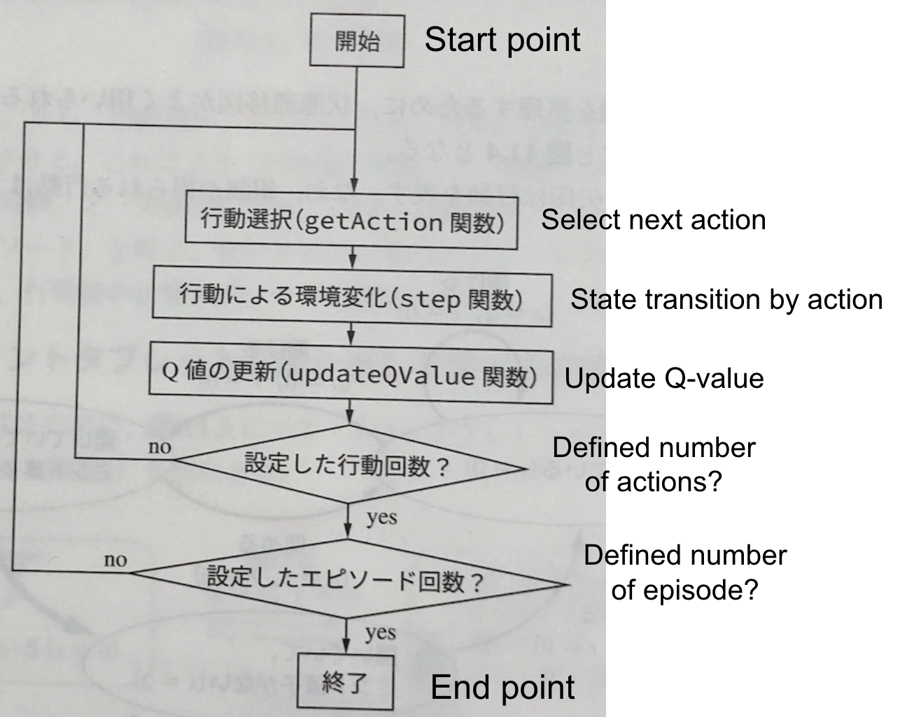
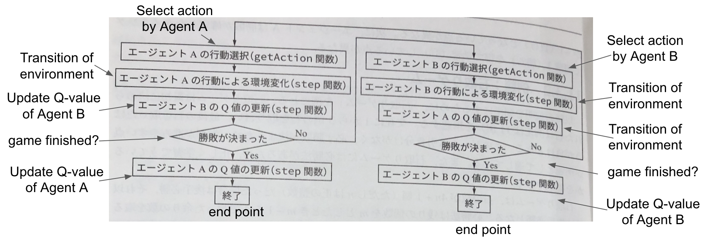
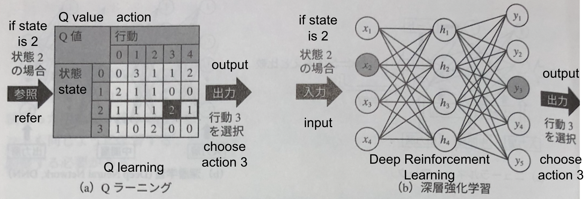

# 強化学習による意思決定モデル
# Decision-Making Model by Reinforcement Learning

## 11.1 強化学習の概要 Abstract of Reinforcement Learning

---

# 11.1 強化学習の概要 Abstract of Reinforcement Learning

- 強化学習とは、試行錯誤しながら、与えられた環境の中でより良い行動を自動的に獲得する学習方法である。
- Reinforcement learning is a learning method where an agent automatically acquires better actions within a given environment through trial and error.

- この時、最終的な状態の良し悪しは与えられるが、過程の良し悪しは与えられない。
- In this situation, the quality of the final state is provided, but the quality of the process leading up to it is not.

- 今回はQラーニングを用いる。
- This time, we utilize Q-learning.

---

# 11.1.1 定義 Definition

---

# 11.1.1 定義 Definition
- エージェント Agent
    - 環境を観測して行動し、報酬の有無を確認して環境に適用するように学習する部分
    - The part where the agent observes the environment, takes an action, and learns by checking if it receives a reward and applying it to the environment.

- 環境 Environment
    - 現在の状態を表示し、エージェントの行動を受けて状態を変化させる部分、報酬の有無もこの部分で提示
    - The part that displays the current state, changes the state based on the agent's action, and presents whether or not a reward is given.

---

# 11.1.1 定義 Definition

- 状態 State
    - エージェントの行動によって変化する部分
    - The part that changes due to the agent's actions.

- 観測 Observation
    - エージェントが現在の状態を知る行為
    - The agent's observation of the current state.

---

# 11.1.1 定義 Definition

- 行動 Behavior
    - エージェントが状態を変えるために行う行為
    - Actions taken by the agent to change the state.

- 報酬 Reward
    - 設定した良い状態もしくは悪い状態になったときに提示する値
    - A value presented when a predefined good or bad state is reached.

---

# 11.1.2 一般式 General function

- 強化学習理論では、行動によって変化する状態をマルコフ決定過程によってモデル化することが一般的とされている。
- In reinforcement learning theory, it is common to model states that change as a result of actions using Markov Decision Processes (MDPs).

- 行動集合 Action set
    - エージェントが取ることのできる行動を全て列挙した集合
    - Set of all possible actions that an agent can take.

$$ a∈A(=a_{1}, a_{2},...) $$

---

# 11.1.2 一般式 General function

- 強化学習理論では、行動によって変化する状態をマルコフ決定過程によってモデル化することが一般的とされている。
- In reinforcement learning theory, it is common to model states that change as a result of actions using Markov Decision Processes (MDPs).

- 状態集合 State set
    - エージェントの行動によって変化できる状態を全て列挙した集合
    - Set of all states that can be changed by the agent's actions.

$$ s∈S(=s_{1}, s_{2},...) $$

---

# 11.1.2 一般式 General function

- 強化学習理論では、行動によって変化する状態をマルコフ決定過程によってモデル化することが一般的とされている。
- In reinforcement learning theory, it is common to model states that change as a result of actions using Markov Decision Processes (MDPs).

- 遷移関数 Transition function
    - 状態sであったときに、行動aを行った時に状態s'となる確率
    - The probability of transitioning from state s to state s' given action a.

$$ T(s,a,s')=Pr(s'|s,a) $$

---

# 11.1.2 一般式 General function
- 強化学習理論では、行動によって変化する状態をマルコフ決定過程によってモデル化することが一般的とされている。
- In reinforcement learning theory, it is common to model states that change as a result of actions using Markov Decision Processes (MDPs).

- 報酬関数 Reward function
    - 状態sの時に行動aを行った場合に得られる報酬
    - The reward obtained by taking action a in state s.

$$ R(s,a) $$

---

# 11.1.2 一般式　General function

- 強化学習理論では、行動によって変化する状態をマルコフ決定過程によってモデル化することが一般的とされている。
- In reinforcement learning theory, it is common to model states that change as a result of actions using Markov Decision Processes (MDPs).

- 初期状態確率 Initial state probability
    - 条件付き確率は初期状態s(0)を決める必要がある場合がある
    - The initial state s(0) may need to be specified to determine the conditional probability.

$$ p(0)=Pr(S(0)) $$

---

# 11.1.3 Q学習 Q learning

- Q学習はQ値Q(s,a)を元にして行動を選択し、行動後のQ値や報酬によって行動前のQ値を更新することで行動戦略を獲得する学習方法である。
- Q-learning is a reinforcement learning algorithm that learns an action strategy by selecting actions based on Q-values Q(s, a) and updating the Q-values before taking the action based on the subsequent Q-value and reward.

- Q値の更新方法は以下の式で表される。
- The update rule for Q-values is given by the following equation.

$$ Q(s,a) <- (1 - α)Q(s,a) + α(r + γmax_{p}Q(s',p)) $$

---

# 11.2.1 1人の意思決定 Decision-Making by one person

- ここでは環境に一つのエージェントが存在し、その行動が状態の変化を起こす問題を扱う。
- In this setting, there is a single agent interacting with an environment, where the agent's actions cause state transitions.

---

# 11.2.2 例題：ミントタブレット問題 Example: Mint tablet problem

- 例題として、ミントタブレットを取り出して食べる問題を扱う。
- As an example, let's consider the problem of taking and eating a mint.

---

# 11.2.2 例題：ミントタブレット問題 Example: Mint tablet problem

- 状態遷移図 State Transition Diagram

---

# 11.2.2 例題：ミントタブレット問題 Example: Mint tablet problem

- コードの実装 Code implementation

---

# EX1 迷路探索 Maze exploration

- 迷路の探索を実装してみよう！
- Let's implement maze exploration

---

# 11.3 2人の意思決定 Decision-Making by two people

- 二つのエージェントの意思決定は以下の理由により複雑となる
- Decision-Making by two agents becomes more complex due to the following reasons.

    - 観測する状態は自分の行動直後の状態ではなく、相手の行動後の状態となる
    - The state you observe is not the state immediately after your action, but the state after the other person's action.

    - 報酬は相手の行動の後に得られることがある
    - Rewards may come after the other person's actions.

---

# 11.3.1 二つのエージェントの意思決定の手順
# 11.3.1 Process of Decision-Making by two agents

- 以下のような流れでエージェントは学習する
- Agents learn as the following process.

---

# 11.4 深層強化学習の概要
# 11.4 Abstract of Deep Reinforcement Learning

- 深層強化学習では、強化学習に深層学習を組み合わせたものである
- Deep reinforcement learning is the combination of reinforcement learning and deep learning.

- ここでは、Q学習とDNNを組み合わせた場合を紹介する
- This time, the case of combining Q-learning and DNN is introduced.

---

# 11.4 深層強化学習の概要
# 11.4 Abstract of Deep Reinforcement Learning

---

# 11.4 深層強化学習の概要
# 11.4 Abstract of Deep Reinforcement Learning

- 他にも画像を入力とした畳み込みネットワーク(CNN)と強化学習の組み合わせもある
- There are also combinations of convolutional networks (CNN) that use images as input and reinforcement learning.