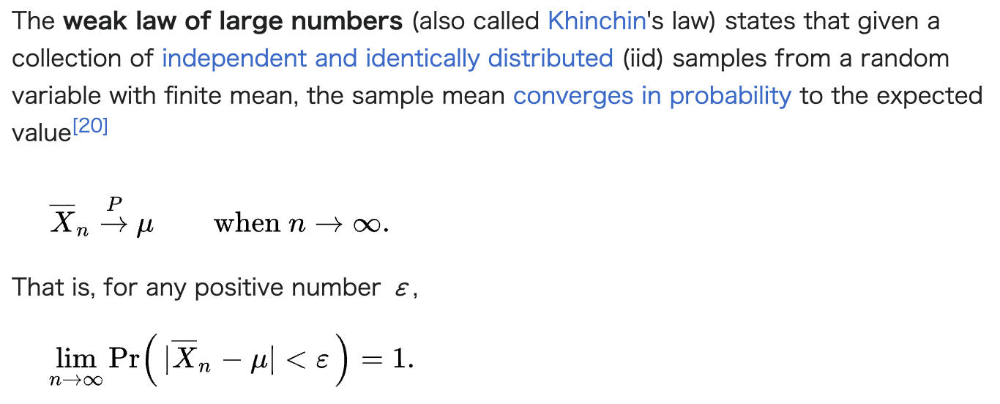
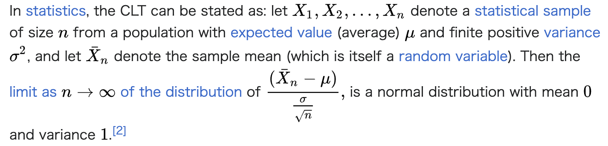
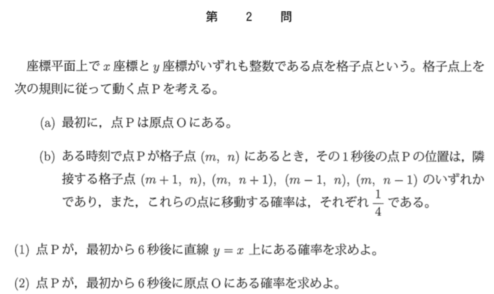
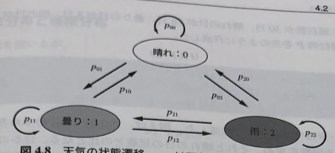
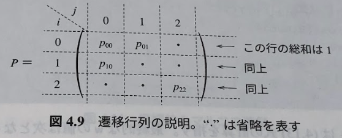
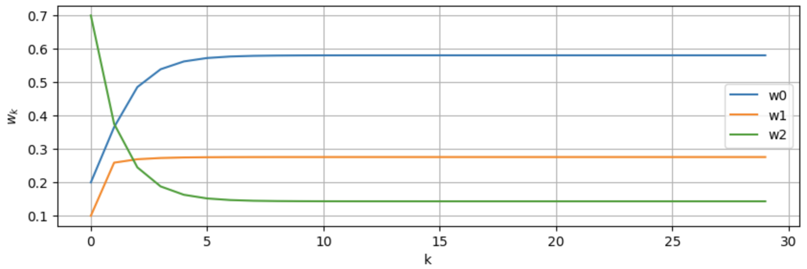
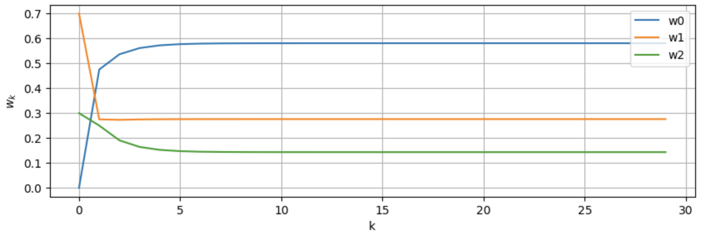
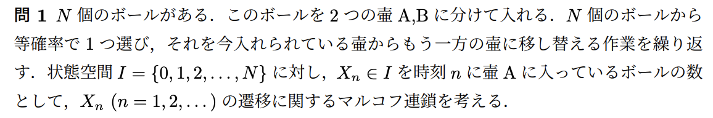
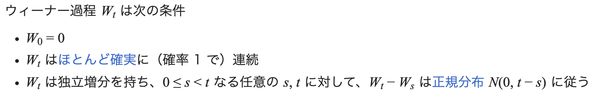
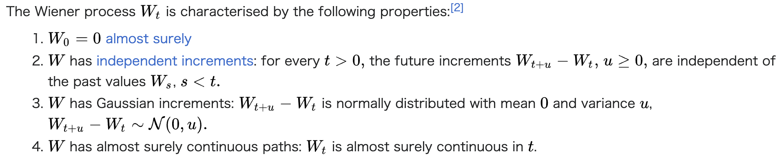

# 確率モデル　Probabilistic Model

## 4.1 簡単なシミュレーション例　Examples of simple simulation
## 4.2 マルコフ連鎖　Markov chain
## 4.3 確率微分方程式　Stochastic differential equation

---

# 4.1 簡単なシミュレーション例
# Examples of simple simulation
- 4.1.1 大数の法則・中心極限定理　Law of large numbers・Central limit theorem
- 4.1.2 ランダムウォーク　Random walk
- 4.1.3 モンテカルロ法　Monte Carlo method

---

# 4.1.1 大数の法則　Law of large numbers
※今回は大数の弱法則を扱う　This time we will deal with the weak law of large numbers

---

# 4.1.1 大数の法則　Law of large numbers
- 簡単に言うなら"サンプル数を増やすと標本平均は平均に収束する"
- Simply put, "as the number of samples increases, the sample mean gets closer to the mean"
↓
- これをシミュレーションで確認してみよう！
- Let's check this by the simulation!

---

# 4.1.1 大数の法則　Law of large numbers
- "SM_BasicLaws_edited.ipynb"を使って大数の法則を確認してみよう
- By using "SM_BasicLaws_edited.ipynb", let's check law of large numbers.

- 平均やサンプル数を変えて何が起こるか確認してみよう！
- What will happen if we change mean and sample size?

---

# 4.1.1 中心極限定理　Central limit theorem

- 簡単に言うと"標本平均と母平均の差は標本の大きさを大きくすると期待値0の正規分布に近づく"
- Simply put, "The difference between the sample mean and the population mean approaches a normal distribution with an expected value of 0 as the number of samples increases."

---

# 4.1.1 中心極限定理　Central limit theorem
- "SM_BasicLaws_edited.ipynb"を使って中心極限定理を確認してみよう
- By using "SM_BasicLaws_edited.ipynb", let's check central limit tehorem.
- 取り出すサンプル数を変えるとどうなっているだろうか？
- What will happen if we change the number of taken sample size?
- 取り出すサンプル数が大きくなるほど母平均に収束しているだろうか？
- Is there convergence to the population mean as teh number of samples taken increases?

---

# 4.1.2 ランダムウォーク　Random walk
$$ X_{i} (i = 1, 2,...) $$
をi.i.d.とした時に、 When above is assumed as i.i.d.,
$$ S_{n} = X_{1} + X_{2} + ... + X_{n} $$
をランダムウォークという is called as "random walk".

- 特に、確率分布が以下のとき単純ランダムウォークと呼ばれる
- Specially, the probability distribution is below, it is called as "a simple random walk".
$$ P(X = 1) = p, P(X = -1) = 1 - p $$

---

# 4.1.2 ランダムウォーク　Random walk
- "SM_RandomWalk_edited.ipynb"を使ってランダムウォークを確認してみよう
- By using "SM_RandomWalk_edited.ipynb", let's check random walk.

- 確率分布を変えるとどうなるだろうか？
- What will happpen if we change the probability distribution?

---

# 4.1.3 モンテカルロ法　Monte Carlo method
- シミュレーションや数値計算を乱数を用いて行う方法の総称
- General methods of simulation and numerial computation using random numbers.
- "MonteCarlo_edited.ipynb"を使ってネイピア数をモンテカルロ法で求めてみよう！
- By using "MonteCarlo_edited.ipynb", let's calculate Napier number by Monte Carlo method!

---

# Exercise 1
- モンテカルロ法を使って円周率を求めてみよう！
- By using Monte Carlo method, let's calculate pi!
- "MonteCarlo_edited.ipynb"を2行編集して円周率を求めてください
- By editing two lines in "MonteCarlo_edited.ipynb", please calculate pi.

---

# Exercise 2
- 東大数学の確率の問題をシミュレーションを使ってゴリ押しで解いてみよう！ 
- (EN version is in the next slide)

(Extra)点Pが、最初からt秒後に直線y=x上にある確率をグラフで示せ。

---

### Problems in EN version
A point on the coordinate plane whose x-coordinate and y-coordinate are both integers is called a grid point. Consider a point P that moves through a lattice point according to the following rule.
(a) First, point P is at the origin O.
(b) If point P is at grid point (m,n) at a certain time, the position of point P one second later is one of the tangent grid points (m+1,n), (m,n+1), (m-1,n) and (m,n-1), and the probability of moving to these points is 1/4, respectively.
(1) Find the probability that point P is on the line y=x 6 seconds after the beginning.
(2) Find the probability that point P is at the origin O 6 seconds after the beginning.
(Extra) Show graphically the probability that point P is on the line y=x after t seconds from the beginning.

---

# 解答 Answer
- (1)5/16 (2)25/256に近い値が得られましたか？
- Did you get closer values: (1)5/16 (2)25/256?

- もし時間が余ったら(1)の答えの二乗が(2)の答えになる理由も考えてみましょう
- If you have extra time, you can also consider why the square of the answer to (1) is the answer to (2)

- (参考)https://www.procrasist.com/entry/todai2017-2

---

# 4.2 マルコフ連鎖　Markov chain
- 4.2.1 マルコフ連鎖とは　What is "Markov chain"?
- 4.2.2 定常分布と極限分布　Stationary distribution and limit distribution
- 4.2.3 定常分布の求め方　How to find stationary distribution

---

# 4.2.1 マルコフ連鎖とは　What is "Markov chain"?
- マルコフ連鎖とは次を満たす確率変数の系列のことであり、大元のマルコフ過程は時系列データ分析・意思決定・動作分析など幅広く応用されている
- A Markov chain is a sequence of random variables that satisfies the following conditions, and the Markov process of the grand source has a wide range of applications in time series data analysis, decision making, behavior analysis, etc.
$$ P(X_{k+1}|X_{k},X_{k-1},...,X_{1}) = P(X_{k+1}|X_{k}) $$
- つまり、次の状態は直前の状態にのみ依存し、それ以前の状態には依存しない、と言う意味である
- This means that the next state depends only on the immediately preceding state and not on the previous state.

---

# 4.2.1 マルコフ連鎖とは　What is "Markov chain"?

- 上記の例を想定する
- Assume the above example.
- この時以下の確率を遷移確率と呼ぶ
- Below probability is called as "Transition Probability".
$$ P(X_{k+1} = j|X_{k} = i) = p_{ij} (i,j = 0,1,2) $$

---

# 4.2.1 マルコフ連鎖とは　What is "Markov chain"?

- 上記を確率遷移(推移)行列と呼ぶ
- Above is called as "Probability Transition Matrix".

---

# 4.2.1 マルコフ連鎖とは What is "Markov chain"?
- "SM_MarkovChain_edited.ipynb"を使ってマルコフ連鎖を確認してみよう！
- By using "SM_MarkovChain_edited.ipynb", let's check Markov chain!
- 初期確率を変えるとどうなるだろうか？
- What will happen if we change initial probability?

---

# 4.2.2 定常分布 Stationary distribution
$$ πP = π $$
- を満たす確率分布πを"定常分布"と呼ぶ
- A probability distribution that satisfies the above equation is called a “stationary distribution.
- これは次を意味する
- This means the following equation.
$$ w_{k} = w_{k+1} $$

---

# 4.2.2 極限分布 Limiting distribution
- スライド19の例のように初期確率を変えてもある確率分布に収束する時、これを極限分布と呼ぶ。この時極限分布は定常分布にもなる。
- When a distribution converges to a certain probability distribution even if the initial probability is changed, as in the example on slide 19, this is called an extreme distribution. In this case, the extreme distribution is also a stationary distribution.

---

# 4.2.3 定常分布の求め方　How to find stationary distribution
- 定常分布を求めるには"固有値と固有ベクトルを用いた方法"と"連立一次方程式を用いた方法"の二つがある
- There are two ways to obtain the stationary distribution: “using eigenvalues and eigenvectors” and “using simultaneous linear equations.
- "SM_MarkovChain_edited.ipynb"を使って、二つの方法を試してみよう！
- By using "SM_MarkovChain_edited.ipynb", let's check two methods!

---

# Excercise 3(JP)
- 以下の問題をpythonで実装してみよう！

- N = 10の時にX_nの推移をグラフで示せ

---

# Excercise 3(EN)
- Let's implement the following problem in python!
- There are N balls. These balls are divided into two jars A and B. One ball is selected with equal probability from the N balls, and the process of transferring it from the jar in which it is currently placed to the other jar is repeated. The state space I = {0,1,2... ,N}, where X_n∈I is the number of balls in jar A at time n. We consider the Markov chain for the transition of X_n(n=1,2,...).
- Show graphically the transition of X_n when N = 10.

---

# 4.3 確率微分方程式　Stochastic differential equation
- 4.3.1 ウィーナー過程　Wiener process
- 4.3.2 確率微分方程式の数値計算
Numerical calculation of stochastic differential equation
- 4.3.3 シミュレーション例　Examples of simulation

---

# 4.3.1 ウィーナー過程　Wiener process
- ウィーナー過程は以下を満たす確率過程であり、数理ファイナンスなど様々な確率現象を扱うシミュレーションで現れる
- A Wiener process is a stochastic process that satisfies the following, and appears in simulations that deal with various stochastic phenomena such as mathematical finance.

---

# 4.3.2 確率微分方程式の数値計算
# Numerical calculation of stochastic differential equation
$$ dx(t) = μ(x(t), t)dt + σ(x(t), t)dw(t) $$ 
(w(t) is wiener process)
- これは実質的には以下と同義である
- This is practically equivalent to the following equation.
$$ x(t) = x(0) + \int_{0}^{t}μ(x(τ),τ)dτ + \int_{0}^{t}σ(x(τ),τ)dw(τ) $$

---

# 4.3.3 シミュレーション例　Examples of simulation
- 今回は幾何ブラウン運動を扱う
- This time, we treat "Geometric Brownian Motion".
$$ dx(t) = μx(t)dt + σx(t)dw(t), x(0) = x_{0} $$
- 解析解は次のようになることが知られている
- The analytical solution is known to be the following equation.
$$ x(t) = x_{0}exp[(μ-\frac{1}{2}σ^2)t + σw(t)] $$

---

# 4.3.3 シミュレーション例　Examples of simulation
- "SM_StochasticDE_edited.ipynb"を使って、ブラウン運動の解析解と数値解を比較してみよう！
- By using "SM_StochasticDE_edited.ipynb", let's check analytical and numerical solutions!