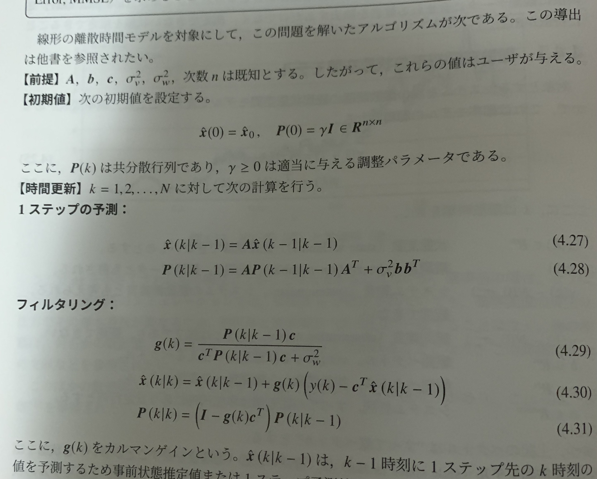
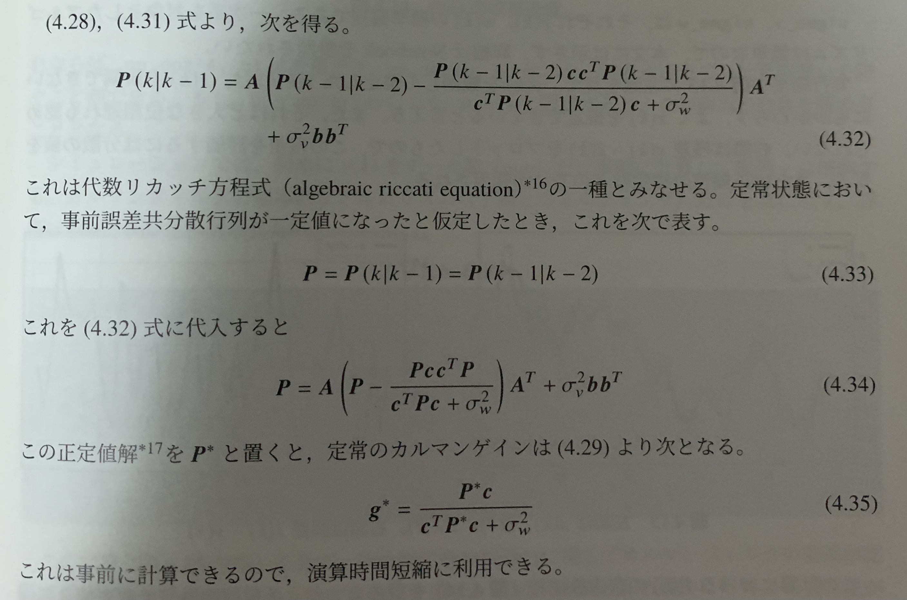

# Pythonコンピュータシミュレーション入門
# Python Computer Simulation

---

# 第4章 確率モデル
# **Chapter 4 Stochastic Model**

--

## 4.4 カルマンフィルタ
## **4.4 Kalman Filter**

--

## 4.5 時系列モデル
## **4.5 Time Series Model**

---

### 4.4 カルマンフィルタ / **Kalman Filter**

- **カルマンフィルタ**とは、誤差を持つ観測値から、観測できない真値を推定する方法
    - 位置の推定、物体の追跡、異常検知などに用いられる
    - 例：ロボットの距離センサと車輪の回転数（どちらも誤差を持つ）から実際の位置を推定

--
- **Kalman filter** is a method for estimating unobservable true values from observed values with errors.
    - Used for location estimation, object tracking, anomaly detection, etc.
    - Example: Estimating the actual position of a robot from its distance sensor and the number of rotations of its wheels (both of which have errors).
 
---

### 離散時間線形の状態空間モデル / **Discrete-time Linear State Space Model**

- **状態空間モデル**とは、複数の状態とそれを駆動する入力があり、状態の動的な変化を表すのに適したモデル
- 状態空間モデルは、時間が離散か連続か、線形か非線形か、確率変数がモデルの中に1つでもあるか、係数が時不変（定数）か時変か、によって理論体系が異なる
  - ここではもっとも単純な離散時間線形確率（かつ定数係数）のモデルを考える

--

- A **state space model** is a model that has multiple states and inputs that drive them, and that is suitable for representing dynamic changes in the state.
- State-space models have different theoretical frameworks depending on whether time is discrete or continuous, linear or nonlinear, whether there is at least one random variable in the model, and whether the coefficients are time-invariant (constant) or time-varying.
  - Here we consider the simplest discrete-time linear probability (and constant coefficients) model.

---

### 離散時間線形の状態空間モデル / **Discrete-time Linear State Space Model**

$$
\boldsymbol{x}(k+1) = \boldsymbol{Ax}(k)+\boldsymbol{b}v(k)
$$
$$
y(k) = \boldsymbol{c}^T\boldsymbol{x}(k)+w(k) 
$$

- $\boldsymbol{x}(k) \in \boldsymbol{R}^n$ : 状態変数 / state variables
- $y(k)$ : 観測量 / observation variable
- $v(k) \sim N(0,\sigma^2_v)$ : システム雑音 / system noise
- $w(k) \sim N(0,\sigma^2_w)$ : 観測雑音 / observation noise
- $\boldsymbol{b} \in \boldsymbol{R}^n$ : 駆動ベクトル / driving vector
- $\boldsymbol{c} \in \boldsymbol{R}^n$ : 観測ベクトル / observation vector
- $\boldsymbol{A} \in \boldsymbol{R}^{n \times n}$ : システム行列 / system matrix
---

### アルゴリズム / **Algorithm**
- カルマンフィルタは観測できる$y(k)$から直接観測できない$\boldsymbol{x}(k)$を推定する
- このため、カルマンフィルタを以下の問題に置き換え、これを解いてみる
 

**カルマンフィルタ問題**
時系列の観測データ$y(k)$を用いて、状態$\boldsymbol{x}(k)$と、この推定値$\boldsymbol{\hat{x}}(k)$との差が最小となる 最小平均二乗誤差推定値（Minimum Mean Square Error, MMSE）を求める

--

- The Kalman filter estimates the unobservable $\boldsymbol{x}(k)$ directly from the observable $y(k)$.
- For this reason, we replace the Kalman filter with the following problem and try to solve it.

**Kalman Filtering Problem**
Using the time series of observed data $y(k)$, find the Minimum Mean Squared Error (MMSE) estimate that minimizes the difference between the state $\boldsymbol{x}(k)$ and this estimate $\boldsymbol{\hat{x}}(k)$.

---
## アルゴリズム / **Algorithm**

---

## 定常カルマンフィルタ / **Steady State Kalman Filter**

---

## シミュレーション例 / **Simlation Example**

- Let's check `SM_KalmanFilter.ipynb` !

---

### 4.5 時系列モデル / **Time Series Model**
- ARMAモデルとSARIMAXモデルを取り上げる
- 前提：対象システムの構造は未知でシステムを駆動する入力は観測できず、システムの出力である時系列データのみを観測できる

--

- We takedARMA and SARIMAX models.
- Assumption: the structure of the target system is unknown and the inputs that drive the system are unobservable, only the output of the system, time series data, can be observed

---

## ARMAモデル / **ARMA Model**
- ARMA = Auto Regressive Moving Average (自己回帰移動平均)
- 離散時間線形の確率系を表す

$$
A(z^{-1})y(k) = B(z^{-1})u(k)
$$

- $u(k)$: input, $y(k)$: output

$$
A(z^{-1}) = 1 + a_1z^{-1} + \cdots + a_pz^{-p} 
$$
$$
B(z^{-1}) = b_0 + b_1z^{-1} + \cdots + b_qz^{-q} 
$$

- $z^{-1}$: 遅延演算子（$z^{-1}y(k)=y(k-1)$）
- パラメータ$a_i,b_j$: 実数
- 次数$(p,q)$: 因果性より$p \geq q$ (proper)

---

## ARMAモデル例 / **ARMA Example**

- Let's check `SM_ARMA.ipynb` !

---

## ARIMAモデル / **ARIMA Model**
- **トレンド**とは、時系列データの重要な周波数成分に、その期間より長いスパンでなだらかに変化するもの
    - 一定値（バイアス）
    - 一次式型（右肩上がり下がり）
    - 周期型（サイン波で表現可能、季節性とも）

--

- **Trend** is a gradual change in an important frequency component of time series data over a longer span of time.
    - Constant value (bias)
    - Linear type (rising and falling steadily)
    - Periodic type (can be represented by a sine wave, also called seasonality)

---
## ARIMAモデル / **ARIMA Model**
- このうち、一次式型のトレンドを除外するモデル：ARIMA
- Of these, the model that excludes linear-type trends: ARIMA

$$
A(z^{-1})(1-z^{-1})^dy(k) = B(z^{-1})u(k)
$$

- $d=1$のときにおいて、 $y'(k) = y(k)-y(k-1) = (1-z^{-1})^dy(k)$
- つまり、ARIMAモデルは$y'(k)$に対するARMAモデルと同じだといえる
- $d\geq 2$は現実的にまず見かけない現象を表す
-- 
- When $d=1$, the ARIMA model is the same as the ARMA model for $y'(k)$.
- The $d\geq 2$ represents a phenomenon that is rarely seen in reality

---

## ARIMAモデル例 / **ARIMA Example**

- Let's check `SM_ARIMA.ipynb` !

---

## SARIMAXモデル / **SARIMAX Model**
- 季節性変動のあるデータを扱う
    - 週次、月次、四半期次、年次、……
- 季節性変動を除去してシステム同定を行うモデル: SARIMAX (Seasonnal ARIMA with eXogenous model)
- 式は複雑なので割愛 

--

- Handles data with seasonal variations
    - Weekly, monthly, quarterly, annual, ......
- Model for system identification by removing seasonal variation: SARIMAX (Seasonnal ARIMA with eXogenous model)
- Formulas are complex and should be omitted. 

---

## SARIMAXモデル例 / **ASRIMAX Example**

- Let's check `SM_SARIMAX_edited.ipynb` !

---

### 演習問題 / **Exercise**

- 未来の東京の気温を予測してみよう
- Let's check `Ex4.ipynb` !

