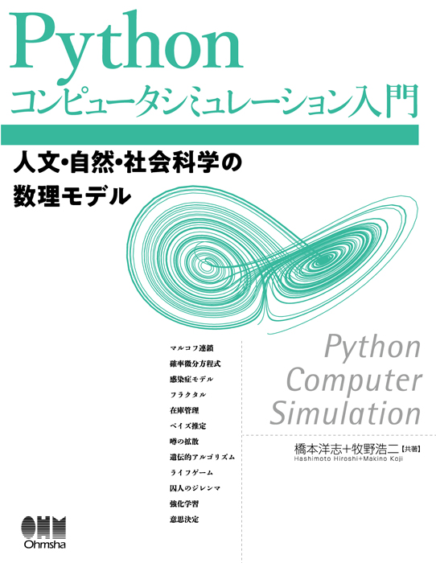

# Python Computer Simulation

---

# **Chapter 6 Management Model** 

-- **About Operation Research**

## **6.1 Some Simple Examples**
## **6.2 Linear Programming (LP)**
## **6.3 Inventory management**
## **6.4 Queueing Theory**

---

### **6.1 Some Simple Examples**

- ***MOTIVATION***: 
  When considering complex content, visualization using graphs can help intuitive understanding.
This will be confirmed through a simple example.

- ***6.1.1 Revolving Payment***: 
  - A type of loan.
It is a mechanism whereby the customer borrows money from a financial institution or other source and repays it.
- ***6.1.2 Break-even point***: 
  - One of the management indicators.
   The point at which **SALES** and **COST** are equal.

---
### **6.1 Some Simple Examples**
- ***6.1.1 Revolving Payment***: 
  - $inter_a$ : anual intersest
   $inter_m$ : monthly interest
   $repay$ : repayment (per month)
   $debt$ : debt balance (last month)

  - **Paying for the interest of this month:** 
     $repay_i = int(debt * inter_m)$
  - ***Paying for the principal of this month:**
     $ret = repay - repay_i$
  - ***Debt balance at the end of this month:**
     $debt = debt  - ret$
---
### **6.1 Some Simple Examples**
- ***6.1.1 Revolving Payment***: 

  - Left one shows the upward convexity of the graph as the remaining balance changes.
Therefore, after 30 months, the rate of decline in the principal gradually increases.   
  - Right one shows the percentage of cash payments out of the monthly fixed payment gradually becomes larger.
  - Making a partial or lump-sum repayment in the middle of the repayment period will exponentially reduce the repayment period. 
---
### **6.1 Some Simple Examples**
- ***6.1.2 Break-even point***: 
-   - **fixed cost** : rent and human resource cost...
   **varible cost**: raw material costs, purchase costs, transportation costs...
   **nonlinear varible cost** : a typical sales environment (e.g., weather, traffic conditions...)
   **cost** : fixed cost + varible cost + nonlinear varible cost

---
### **6.1 Some Simple Examples**
- ***6.1.2 Break-even point***: 
  calculate **break-even point**:

At the intersection（break-even point） on the left side, a loss occurs if the value is below and a profit occurs if the value is above

---

## **6.2 Linear Programming (LP)**
- ***6.2.1 Mathematical expression***: 
   - Objective function: 
  $$
  \text{arg} \min_{x, y} f(x, y) = -4x + y
  $$
  - Constraint condition: 
  $$
    \text{subject to:}
    \begin{cases}
    0 \leq x \leq 3 \\
    0 \leq y \leq 1 \\
    x + y \leq 2
    \end{cases}
  $$
---
## **6.2 Linear Programming (LP)**
- ***6.2.2 Can use PuLP***: 
  
---
## **6.2 Linear Programming (LP)**
- ***6.2.3 Simulation sample***: 
  Please Check -> MM_LP.ipynb
---
## **6.3 Inventory management**
- ***6.3.1 What is inventory management***: 
  - **Inventory** :The term is used to refer to goods (merchandise, materials, etc.) stored in the warehouses of stores and factories 
  - **Excessive inventory** cost occurs when inventory is too large for **demand**. 
  - If inventory is too small relative to demand, **Inventory shortage cost** arise at the time of insufficient inventory. 
  -> **Periodical ordering system** and **Order point system**
---
## **6.3 Inventory management**
- ***6.3.2 Economic Order Quantity(EOQ)***:
  - $Q$ : **Order quantity** for one time
    $C_{year}$ : **Annual maintenance cost** per item [yen/(item/year)]
    $C_{one}$ : **Ordering cost** per order [yen]  
    $D$ : **Demand** per year [pcs/year]
  $$Q^* = \sqrt{\frac{2 C_{\text{one}} D}{C_{\text{year}}}}$$

---
## **6.3 Inventory management**
- ***6.3.3 Order point system***:
   This is a method of inventory management in which a certain amount of orders are placed when the inventory level drops to a certain level. 
- $O_p$ : **Ordering point** 
  $L$ : **Lead time** 
    $\bar d$ : **demand for one day** 
    $S$ : **Safety stock**
    $k(\alpha)$ : **Safety factor** 
    $ \sigma^2$ :Dispersion of **demand**
    $$O_P = L \bar{d} + S $$  $$O_P = L \bar{d} + k(\alpha) \sigma \sqrt{L} $$
---
## **6.3 Inventory management**
- ***6.3.4 Periodocal ordering system***:
 This is a method in which the order cycle (also called the order interval) is predetermined and the order is placed.
- $T$ : **Ordering cycle interval** 
  $Q$ : **Order quantity** 
  $Q^*$ : **EOQ** 
  $L$ : **Lead time** 
  $k(\alpha)$ : **Safety factor** 
  $ \sigma^2$ :Dispersion of **demand**
  $x_k$ : **Inventory level** when k
  Almost the same as the previous method.
  The quantity in stock at the next time $x_{k+1}$ is as follows:
  $$x_{k+1} = x_k + Q = (T + L) \bar{d} + \left( k(\alpha) \sigma \sqrt{T + L} \right)$$
---
## **6.3 Inventory management**
- ***6.3.5 Sample of simulation***:
  -> check MM_Inventory.ipynb
  
  - It can be seen that the inventory volume is smaller in the order placement method.

---

##  **6.4 Queueing Theory**
- ***6.4.1 What is queueing***:
  - Queueing are the phenomenon of customers waiting at the ATMs of banks, ticket sales windows, supermarket registers, etc.
- ***6.4.2 Kendall's notation***:
-  If the **customer arrival process** is M, the **service time** is M, and the number of services (**number of windows**) is C, the waiting process model is expressed as **M|M|C**.
  -> Today's simulation will all based on **M|M|1**
---
##  **6.4 Queueing Theory**
- ***6.4.3 Poisson Arrival Process and Arrival Time Distribution***:
  - The following equation shows that **the number of customers $k$** arriving in one unit of time follows a **Poisson distribution**.

    $$P(k) = e^{-\lambda} \frac{\lambda^k}{k!}$$
    - $\lambda$ :Average number of passengers per hour
    $1/\lambda*$ : Average time interval between arrivals
  - In case of arrival of a poisson, **the interval of arrival time** of the poisson follows an exponential distribution. **The probability that the next customer will arrive** within T hours after one customer's arrival is:
    $$P_{\text{arr}}(T) = 1 - P^c(T) = 1 - e^{-\lambda T}$$
---

##  **6.4 Queueing Theory**
- ***6.4.3 Poisson Arrival Process and Arrival Time Distribution***:
  ->Check MM_Poisson.ipynb
    
    
    The larger $\lambda$ is considered shorter for the time distribution until the next guest arrives. 
---
##  **6.4 Queueing Theory**
- ***6.4.4 Exponential service time distribution***:
  -  If the service time T per person follows an exponential distribution, the probability that the service will be completed in T hours or less is expressed as: 
     $$P_{\text{srv}}(T) = 1 - e^{-\mu T}$$
     - $\mu$ :Average number of persons served(per unit time)
      $1/\mu*$ : Average hours of service(per person)
  - Highly variable service times are undesirable because they lead to longer wait times and inconsistent customer experiences. 
---
##  **6.4 Queueing Theory**
- ***6.4.5 Evaluation indicators***:
  -  Utilization rate: $\rho = \lambda/\mu$
  -  Average number of persons in the system: $L = \lambda/\mu(1-\rho)$
  -  Average number of persons in the queue: $L_q = L-\rho$
  -  Average waiting time in the system: $W = L/\lambda$
  -  Average waiting time in the queue: $W_q = L_q/\lambda$
  -  **Little's law**: the relationship between the number of customers and waiting time 
      $$ L = \lambda W$$    $$ L_q = \lambda W_q$$
---
##  **6.4 Queueing Theory**
- ***6.4.6 Use SimPy to do the simulation***:
  - SimPy is a discrete-event simulation that can be run on Python, and is a type of event-driven programming.
- - ***6.4.6 Use SimPy to do M|M|1 simulation***:
  -> Check MM_MM1.ipynb
     
  - The vertical axis shows the number of waiting customers, and the range on the horizontal axis in the left figure is simulation time. 
     We can see that a maximum of 16 people are waiting in line (left graph). 
    We can use it to studing about what effect does the maximum waiting line have on the level of customer satisfaction? How many more windows will you need to achieve a good balance between cost, customer satisfaction and brand?...
---

