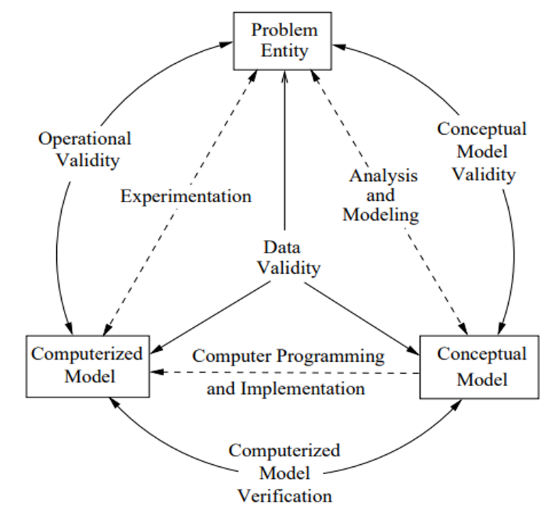
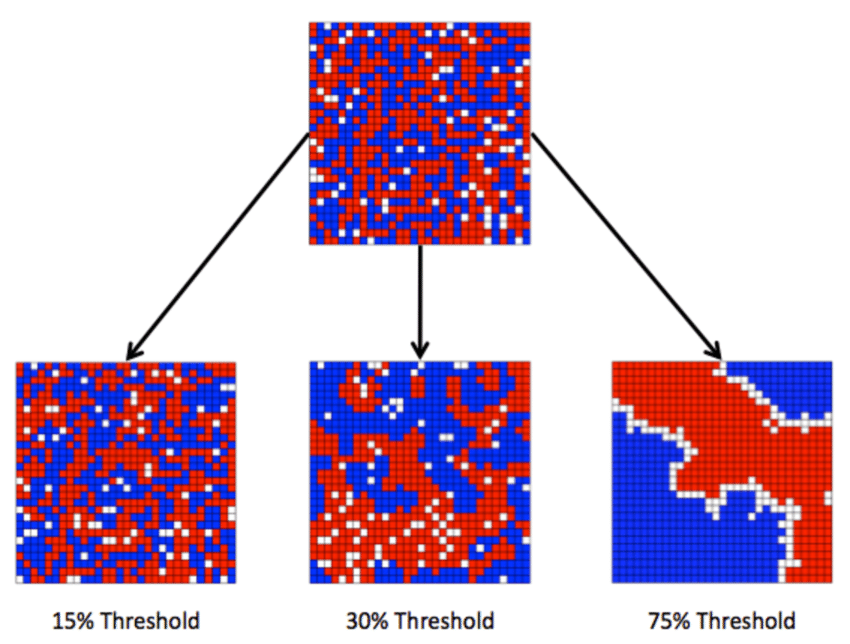
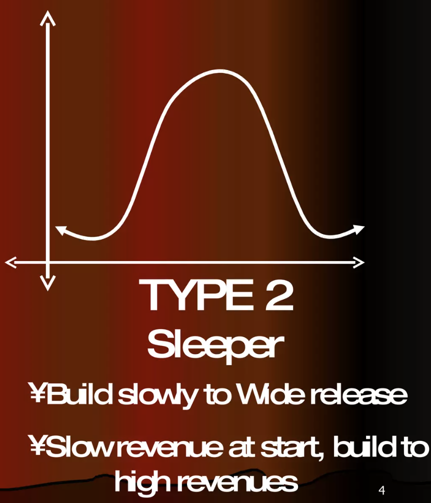
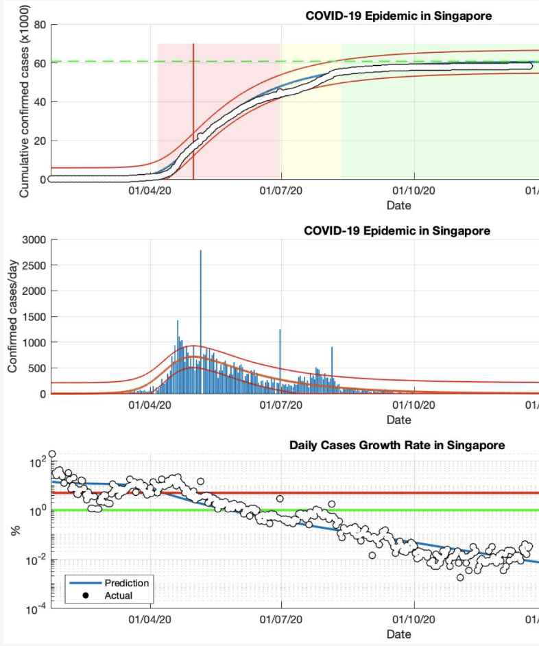

# Social System Modeling

---

# **Lecture #1 on Social System Modeling**

--

## **1. Motivation for Social System Modeling**
## **2. Modeling flow**
## **3. Resolution of model**
## **4. Reliability evaluation of model**
## **5. Parameter setting of model**
## **6. Scenario analysis**

---

### **1. Motivation for Social System Modeling**

- What is about **social system**?
  - Social system focuses on humans and their interactions, rather than nature.
  - You can check definitions of **society** by Tominaga (1995) to consider social system
    1. There are interactions or communications among members.
    2. Members of societies last for some time; they don't dismiss soon.
    3. Members are organized.
    4. There are boundaries deviding people into members and non-members.
- Why do you model social systems?
  - Some social systems have problems or unknowns.
  - ***Such problems and unknowns are often tough to solve or analyze due to complexity and uncertainty of the social systems.***
  - ***Social system modeling enables you to deal with the comlexity and uncertainty and tackle the problems and unknowns in a better way.***
 
---

### **2. Modeling flow**
1. Identify problems in society.
2. Define a social system.
3. Describe concepts and structures of the social systems with natural langages, equations, or figures.
4. Program the conceptual model into computerized model with computers and programming languages.
5. Evaluate reliability of the models.
6. Set parameters of the computerized models.
7. Conduct scenario analyses.

---

### **3. Resolution of model**

- **Resolution (解像度)** of model as a hint to build conceptual models
  - How detailed can you describe social systems?
- There are mainly three types of social model depending on resolution.
  - It ***doesn't*** matter which type of model you select itself.
  - ***Objectives of cocial system modeling guide you in decisons on resolution of models.***
  - ***Resolution guides you in choices on reliability evaluation of model.***

| Resolution         | Description                                                                       | Objective                                                                                              | Reliability evaluation                                                         | 
| ------------------ | --------------------------------------------------------------------------------- | ------------------------------------------------------------------------------------------------------ | ------------------------------------------------------------------ | 
| **Abstract model**     | Simple models with a few essential structures                                     | - To comprehend micro-macro link mechanisms - To build theories - To obtain insights             | - Acceptable micro behavior and holistic features of system        | 
| **Middle-range model** | More realistic models with more parameters, describing specific situations        | - To build prototypes to support  decision-making - To comfirm or generate stylized facts | - Consistency with stylized facts                                  | 
| **Facsimile model**    | Most realistic models with less universality, describing very specific situations | - To conduct scenario analyses                                                                         | - Survey on agents' behavior model - Consistency with real data | 

---

### **3.1. Example of abstract model**
- **Segregation (分居) model** by Schelling in 1971
- There are 2 types of agents on cells.
- One type of agent on a cell stay there when it finds fewer another type of agent on Moore neighborhood (ムーア近傍) than threashold.
- One type of agent on a cell moves to another cell randomly when it finds more another type of agent on Moore neighborhood than threashold.
- A simple model with just one parameter (thereshold) describes how and why people live with similar ones.

---

### **3.2. Example of middle-range model**
- Variation types for box office (興行収入) of film market proposed by Ainslie et al. in 2005
- There are two **stylized facts (定型化事実)** in film market.
  - In general, stylized facts are phenomena  which are observed with reproducibility, with or without explanation of the mechanisms.
  - **Blockbuster-type** has an early and high peak.
  - **Sleeper-type** has a slow starting and a late and short peak.
- The model focus on film market but does not mention any specific work.
- The model helps confirm and analyze stylized facts, and helps creates prototypes to support decision-making on advatisement and marketing.

---

### **3.3. Example of facsimile model**
- Analyses on COVID-19 by SIR model by Kartono et al. in 2021
- **SIR model** is a very general model but it is applied to a specific epidemic and specific countries at specific period in this study.
- The model includes parameters validated by real data.
- The model help forecast long-term trend of COVID-19 in specific countries.

---

### **3.4. Exercise for your research in terms of resolution**
- What type of model do you build in your research?
  1. Pick up one research project of yours to consider which the project is social system modeling or not, refering to the difinitions of society on slide #3. Otherwise, show the reasons why your project is not social system modeling.
  2. Classify your research project into abstract model, middle-range model, or facsimile model.
  3. Consider how you would build the other types of model with the same research theme.
- An example is shown below.
  - Abstract model: Environmental action by penalty and reward
  - Middle-range model: Analysis on GHG emission mitigation in international maritime transport focusing on the relationship between carbon levy (炭素課金) and freight rate (運賃)
  - Facsimile model: Evaluation of the environment regulations for net-zero GHG emissions by 2050 in international maritime transport (Original reserach project)

---

### **4. Reliability of model**
- ***It is important to evaluate how reliable your models are.***
- There are mainly three perspectives to evaluate models, which is called **VV&A**.
  1. **Verification (正当性の評価)**: How right do your computerized models work?
  2. **Validation (妥当性の評価)**: How right do you build conceptual models?
  3. **Accreditation (実行承認性の確認)**: How robust are your models for practical use?

---

### **4.1. Verification of model**
- Do your computerized models reflect your conceptual models and your intentions?
- In other words, do not your computerized models have any bug?
- ***Verified models are ones without bugs.***
- Difficulties of verification
  - It is unclear what kind of results indicates correct behavior of models.
  - Bugs often result from logical errors of models.
  - It is challenging to determine parameter setting methods.
- How to prevent and remove bugs from computerized models?
  -  Make comments on codes.
  -  Introduce test codes into functions or functional units.
  -  Refer to development processes in Information System field.

---

### **4.2. Validation of model**
- ***Are your models able to achieve the modeling objectives?***
- You often hear that your models are arbitrary or not realistic, but...
  - Realistic models do not always represent they are able to achieve the modeling objectives.
  - Realistic models are often as complex as real world, which makes analyses tough.
  - To put it boldly, useful models are abstract and simplified arbitrarily, according to the modeling objectives.
  - ***Models for social simulations should be validated by the correspondence with their modeling objectives.***
- How to validate models?
  -  See if your models generate similar results to real data.
  -  See if your models reproduce phenomena explained by accepted theories, models, or stylized facts.
- Tips for building validated models
  - Adopt plural (多元的) models rather than unitary models to model complex realities.
  - ***Remember modeling objectives***.

---

### **4.3. Accreditation of model**
- Are your models robust enough to be applied to practical use?
- How to accredit models?
  - Commit to real social issues and give simulation results back to organization or people concerned.
  - It is especially important to have authorized managers (decision takers) accredit models as well as those who face the issues on spot.
  - Models would not be used in the real world without accreditation by such decision takers.
- What are methodogies for accreditation?
  - Methodogies for accreditation are still underdevelopment.
  - Generally, modelers design hypothetical methods based on knowledge and methodogies in relevant fields according to social issue, discuss the results, and give feedback to the methods.
  - Accreditation is deeply connected with comminication with people concerned with social issues, so it is also effective to build models with such people together.

---

### **5. Parameter setting of model**
- The main challenge for building models is setting parameters.
- There are mainly six ways to set parameters of model.
  1. Collect and refer to real data.
  2. Conduct **sensitive analyses (感度分析)**.
  3. Conduct **inversive simulations (逆シミュレーション)**.
  4. Conduct **virtual grounding**.
  5. Estimate parameters by **Bayesian network**.
  6. Adopt unknown or uncertain parameters as scenario -> Go to Chapter 6

---

### **5.1. Sensitive analysis**
- Models contain many parameters, but some of which are tough to set.
  - Because there is no data to be referred.
  - Because you cannot observe nor measure the parameters.
- You can prepare many options for such parameters to conduct simulations with and pick up ones which provide intended outputs.
- How to set parameters by sensitive analysis?
  1. Select parameters for the analysis.
  2. Analyze the relationships and influences of the parameters.
  - Parameters can be set independently if the parameters if the parameters affect each different objective functions.
  - Parameters should be determined in order of influence if the parameters affect same objective functions.
  3. Prepare options for the parameters and objective functions.
  4. Conduct simulations to pick up a set of options which optimize the objective functions.

---

### **5.2. Inversive simulations**
- Too many parameters make it tough to analyze the relationships and influences of the parameters nor conduct sensitive analyses one by one.
- In that case, inversive simulations are adopted as a solution for an inversive problem.
- A representative approach for inversive simulations is **genetic algorithm (遺伝的アルゴリズム)**, which is a general method to search a huge solution space efficiently.
- How to set parameters by genetic algorithm?
  1. Select parameters for the analysis.
  2. Create a set of genes corresponding to the parameters.
  3. Prepare objective functions.
  4. Conduct simulations with the genes.
  5. Update the genes.

---

### **5.3. Virtual grounding**
- **Grounding** is a method to collect data for modeling by questionnaire or survey.
- Virtual grounding is another method of creating virtual world to have participants make decisions there and collecting data for modeling, when questionnaires and surveys are not available.
- An example of situation requiring virtual grounding
  - Modeling behavior of the visitors at Disney Land requires comprehensive data of the visitors, such as movement log and perchase history.
  - But the theme park does not allow to take questionnaires nor put GPS on the visitors there.
- How to set parameters by virtual grounding?
  1. Extract qualitative characteristics of agents from a terget system to determine the behavior structures of the agents with accepted existing models, such as **multinomial logit model (多項ロジットモデル)**.
  2. Collect participants to make decisions in the virtual situation.
  3. Estimate the values of parameters based on the data with methods corresponding to the models adopted at Step 1, such as **maximum likelihood estimation (最尤推定)** for multinomial logit model.

---

### **5.4. Bayesian network**
- Bayesian network is a probabilistic graphical model that represents a set of variables and their conditional dependencies via a directed acyclic graph (有向非巡回グラフ).
- When behavior models have multiple behavior causes and sets of the causes determine the behavior probabilistically, Bayesian networks are helpful to get the probalities of the behavior.
- Bayesian networks also help identify the best relationships among the behavior factors.
- How to set parameters by Bayesian network?
  1. Take surveys on a terget domain.
  2. Create a behavior model for agents.
  3. Generate a hypothetical Bayesian network out of the behavior model.
  4. Collect data with questionnaires.
  5. Construct a Bayesian network and determine the behavior model.
  6. Estimate the values of parameters.
- You can refer to the textbook for an example of modeling insurance market by Bayesian network, as it is too long to talk here.

---

### **6. Scenario analysis**
- Social systems must have uncertainties.
- You cannot remove all uncertainties from social simulations.
- ***The biggest objective of social simulation is showing possible futures under uncertainty, not showing one only result in future.***
- ***Scenario analyses (シナリオ分析) help visualize bunches of possibility (可能性の束) and support future decision-making under uncertainty.***
- There are mainly three ways to analyse simulation results.
  1. **What-if analysis (What-if分析)**: Analyze results with defferent inputs or conditions.
  2. **Uncertainty analysis (不確実性分析)**: Analyze impacts of uncertainties on results.
  3. **Hypothetical scenario analysis (仮説シナリオ分析)**: Analyze what hypothetical scenarios generate current social systems.

---

### **6.1. What-if analysis**
- Conduct simulations with different inputs or conditions to identify the impacts of the scenarios on the results.
- There are two types of what-if analyses.
  1. Try various inputs with conditional variables fixed.
  - I call them case studies in papers.
  - An example of this kind of what-if analysis is trying verious GHG measures (対策) under specific future prices of methanol and ammonia.
  - ***You can analyze what inputs are effective on specific conditions.***
  2. Try various conditions with inputs fixed.
  - An example of this type of what-if analysis is trying verious future prices of methanol and ammonia under a specific GHG measure.
  - ***You can analyse on what conditions specific inputs are effective.***

---

### **6.2. Uncertainty analysis**
- Conduct simulations with uncertainties and with no/few uncertainties to identify the impacts of the uncertainties on the results.
- You can compare results when indentifying multiple uncertainties in your models.
- It is meaningful to see if specific uncertainties in models affect significantly the simulation results or not.
  - ***If the uncertainties affect significantly the results, you can discuss how important it is to mitigate the uncertainties.***
  - ***Otherwise, you can discuss that the uncertainties are not so important for the scenario analysis.***
- You can refer to the textbook to for an example of analysing achievement evaluation system (業績評価制度) for companies by uncertainty analysis.

---

### **6.3. Hypothetical scenario analysis**
- In many cases, you build a model that reproduces a target social system, conduct simulations with verious scenarios, and analyse their possible futures.
- On the other hand, hypothetical analyses allow you to input hypothetical scenarios in past and to simulate current social systems.
  - ***Hypothetical analyses enable you to discuss which hypothetical scenario reproduces a target social system and to identify its mechanisms, processes, and conditions.***
  - Note that ***hypothetical analyses focus on mechanisms, processes, and conditions generating current social systems, rather than possible futures.***
- You can refer to the textbook for an example of discussion on the causes why you stand on left/right and walk on right/left on escalator by hypothetical analysis.

