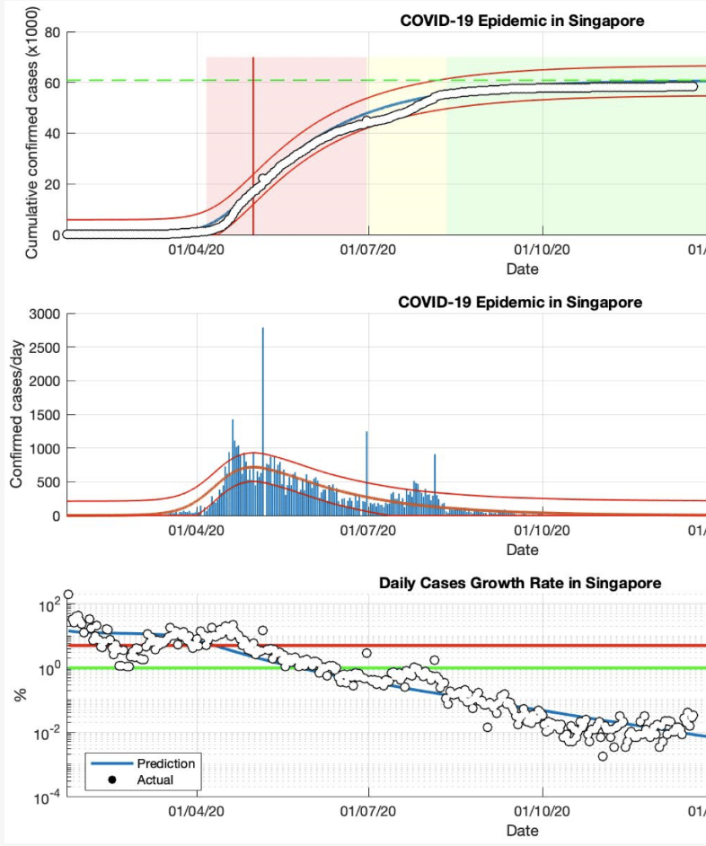

# Social System Modeling

---

# **Lecture #1 on Social System Modeling**

--

## **1. Motivation for Social System Modeling**
## **2. Resolution of model**
## **3. Modeling flow**
## **4. Verification, Validation and Accreditation**
## **5. Setting of simulation**
## **6. Scenario analysis**

---

### **1. Motivation for Social System Modeling**

- What is about **social system**?
  - Social system focuses on humans and their interactions, rather than nature.
  - You can check definitions of **society** by Tominaga (1995) to consider social system
    1. There interactions or communications among members
    2. Members of societies last for some time; they don't dismiss soon.
    3. Members are organized.
    4. There are boundaries deviding people into members and non-members
- Why do we model social systems?
  - Some social systems have problems or unknowns.
  - You describe concepts of such social systems with natural langages, equations, or figures.
  - And then, you embody the concepts with computers and programming languages.
  - Finally, you solve or comprehend the social systems with your models.
 
---

### **2. Resolution of model**

- **Resolution (解像度)** of model
  - How detailed can you describe a target?
  - There are mainly three types of social model depending on resolution.

| Resolution         | Description                                                                       | Objective                                                                                              | Validation                                                         | 
| ------------------ | --------------------------------------------------------------------------------- | ------------------------------------------------------------------------------------------------------ | ------------------------------------------------------------------ | 
| **Abstract model**     | Simple models with a few essential structures                                     | - To comprehend micro-macro link mechanisms - To build theories - To obtain insights             | - Acceptable micro behavior and holistic features of system        | 
| **Middle-range model** | More realistic models with more parameters, describing specific situations        | - To build prototypes to support  decision making - Comfirm or generate **stylized facts (定型化事実)** | - Consistency with stylized facts                                  | 
| **Facsimile model**    | Most realistic models with less universality, describing very specific situations | - To conduct scenario analyses                                                                         | - Survey on agents' behavior model - Consistency with real data | 

---

### **2.1 Example of abstract model: Segregation model**
- **Segregation (分居) model** by Schelling in 1971
- There are 2 types of agents on cells.
- One type of agent on a cell stay there when it finds fewer another type of agent on Moore neighborhood (ムーア近傍) than threashold.
- One type of agent on a cell moves to another cell randomly when it finds more another type of agent on Moore neighborhood than threashold.
- A simple model with just one parameter (thereshold) describe how and why people live with similar ones

---

### **2.2 Example of middle-range model: Variation types for box office of film market**
-  and  proposed by Ainslie et al. in 2005
- **Blockbuster-type** has an early and high peak.
- **Sleeper-type** is slow start and has a late and short peak.
- The model focus on film market but does not mention any specific work.
- The model helps confirm and analyze stylized facts, and helps creates prototypes to support decision making on advatisement and marketing.

---

### **2.3 Example of facsimile model: Epidemic prevention**
- Analyses of COVID-19 by SIR model by Kartono et al. in 2021
- **SIR model** is a very general model but it is applied to a specific epidemic and specific countries at specific period in this study.
- The model includes parameters validated by real data.
- The model help forecast long-term trend of COVID-19 in specific countries.

---

### **3. Modeling flow**
1. Identify problems in society.
2. Define a social system.
3. Describe concepts and structures of the social systems with natural langages, equations, or figures.

---

### **4. Verification, Validation and Accreditation**
1. Identify problems in society.
2. Define a social system.
3. Describe concepts and structures of the social systems with natural langages, equations, or figures.

---

### **5. Setting of simulation**
- The main challenge for building models is setting parameters.
- There are mainly six ways to set parameters of model
  1. Collect and refer to real data.
  2. Conduct **sensitive analyses (感度分析)**. -> Go to the special session #2
  3. Conduct **inversive simulations (逆シミュレーション)**. -> Go to the special session #2
  4. Conduct **virtual grounding** -> Go to the special session #2
  5. Estimate parameters by Bayesian network -> Go to the special session #2
  6. Adopt unknown or uncertain parameters as scenario -> Go to the next slide

---

### **6. Scenario analysis**
- What is about **scenario analysis**?
- There are mainly three ways to analyse simulation results.
  1. **What-if analysis** -> Go to the special session #2
  2. **Uncertainty analysis (不確実性分析)** -> Go to the special session #2
  3. **Hypothetical scenario analysis (仮説シナリオ分析)** -> Go to the special session #2

